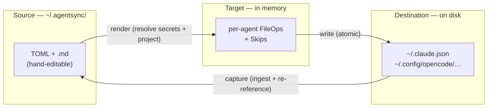
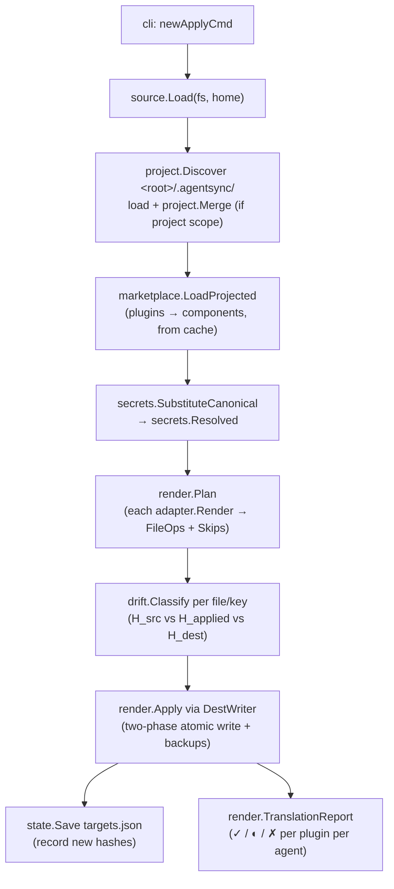
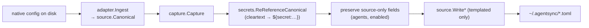

# Architecture

How agentsync is put together: the data model, the apply/capture pipelines, the
drift classifier, and the safety and secrets invariants that make it trustworthy
enough to point at your real config and your real credentials.

If you haven't yet, read [Concepts & glossary](concepts.md) first — this page
assumes that vocabulary. For a package-by-package index, see the
[component map](components.md).

---

## 1. The three-state model

agentsync inherits chezmoi's three-state design. Every operation is a comparison
between **Source** (what you committed), **Target** (what the source renders to,
computed in memory), and **Destination** (what's on disk in each agent).



Drift is a hash comparison against the **last-applied** hashes recorded in
state: if the destination's hash no longer matches what agentsync last wrote, the
file was edited outside agentsync.

---

## 2. The canonical model *is* the schema

There is no separate internal IR. The Go structs in `internal/source` that parse
the TOML/markdown in `~/.agentsync/` are the canonical model
(`source.Canonical`), and adapters render directly from it. Adding a component
field means changing those structs; adding an agent means adding an adapter that
consumes them — the schema is the contract between the two.

```
source.Canonical
├── Config          (agentsync.toml: agents, update defaults, secrets backend, [memory] banner)
├── MCPServers      (mcp/*.toml)
├── Skills          (skills/<name>/ — SKILL.md + bundled scripts/references/assets)
├── Subagents, Commands, Hooks, LSPServers
├── Plugins, Marketplaces   (plugins/*.toml, marketplaces/*.toml)
├── Memory          (memory/AGENTS.md + fragments/; rendered files get the managed banner — see below)
└── Project         (overlay loaded from a <root>/.agentsync/ tree, project scope)
```

At **project scope** the same canonical is loaded a second time from the repo's
`<root>/.agentsync/` tree (identical layout) and overlaid onto the user canonical
by `project.Merge`: entries are merged by id/name (project wins), project memory
is appended, an empty project `[agents]` inherits the user's enabled agents, and
a project `plugins/<id>.toml` with `disabled = true` is excluded from projection
in that repo. The retired M5 single-file `.agentsync.toml` marker is no longer
read — `project.Discover` surfaces a migration error if it finds one.

**Managed memory banner.** Every rendered memory file (`CLAUDE.md`, `AGENTS.md`,
…) is prepended with a short agentsync notice naming the file and pointing edits
back at `.agentsync/memory/AGENTS.md` + `agentsync apply`. Every adapter renders
memory through the one helper `source.RenderManagedMemory` (which wraps
`ExpandMemoryImports`), so the banner is byte-identical across agents. It is a
property of the *rendered destination file only* — it is wrapped in reversible
`<!-- agentsync:managed memory-banner -->` markers (the `agentsync:managed`
namespace carries a per-marker identifier so future managed markers stay
unambiguous) and stripped by `source.StripManagedBanner`
on the way back in (each adapter's ingest, plus a backstop at the `import` /
`reconcile` write-back funnels), so it never enters the canonical source and never
compounds. Because the banner text is static (only the filename varies) it hashes
identically on every render, so an untouched file still classifies `InSync` — the
banner never manufactures drift. It is on by default; `[memory] banner = false`
in `agentsync.toml` opts out (the project overlay inherits the user setting unless
it sets its own). The `agentsync:managed` marker is **reserved**: `checkReservedMarkers`
(in `loadMemory` and `WriteMemory`) rejects a canonical whose body or a fragment
carries it rather than letting it collide with the banner's markers, and
`StripManagedBanner` matches agentsync's full rendered banner (not the bare
markers) so it removes only agentsync's own banner — a user-authored marker block
is preserved, never deleted.

---

## 3. The adapter contract

Every agent integration implements one interface (`internal/adapter/adapter.go`):

```go
type Adapter interface {
    Name() string
    Capabilities() Capability       // bitmask: MCP, Memory, Skill, Subagent, Command, Hook, LSP
    Detect() (bool, error)          // is this agent installed?
    Render(r secrets.Resolved, scope Scope, project string) ([]FileOp, []Skip, error)
    Ingest(scope Scope, project string) (source.Canonical, error)
    KeyMergeStrategy() string       // "merge-json-keys" | "merge-jsonc-keys" | "merge-toml-keys" | ""
    Apply(ops []FileOp, w DestWriter) error
}
```

Two design points worth internalizing:

- **`Render` accepts only `secrets.Resolved`, never a raw `source.Canonical`.**
  `Resolved` is a wrapper type produced by secret substitution; you cannot pass
  the templated source model to `Render`, and you cannot pass the resolved
  (cleartext) model to a source writer. This makes "leak a resolved secret back
  into source" a *compile error*, not a code-review check.
- **Every destination write goes through `DestWriter`.** Adapters never call
  `iox.AtomicWrite`/`os.Remove` directly. `DestWriter` owns the
  foreign-collision backup invariant (back up any pre-existing file agentsync
  doesn't yet own, before overwriting). A `forbidigo` lint rule fails any direct
  write outside the allowed packages, so a new adapter can't regress the backup
  guarantee.
- **Project scope requires a project root.** Each adapter's `ResolvePaths` falls
  through to *user*-scope paths when the project root is empty, so a
  `(ScopeProject, "")` call would silently write the project overlay into the
  user's global config. Every scope-resolving adapter method —
  `Render`, `Ingest`, and `IngestPlugins` — calls `adapter.RequireProjectRoot`
  first thing and returns `ErrProjectRootRequired` instead — a loud failure at
  the narrowest waist rather than a silent wrong-scope I/O. The CLI's
  `resolveScope` already guarantees a non-empty root for project scope, so this
  is defense-in-depth against a future or non-CLI caller.

`Capability` is a bitmask, so the OpenCode adapter simply omits `CapHook` and
`CapLSP` (and the Codex and Cursor adapters omit `CapLSP` — neither has an LSP
concept) and the pipeline reports those components as skipped.

**Skips are typed, not stringly-classified.** A `Skip` carries a `Kind`
(`adapter.SkipKind`): `SkipDropped` when the whole component had no native target
and was not emitted, `SkipReduced` when it rendered but lost fields the agent has
no home for (a subagent's Claude-only `tools`/`color`, a command's frontmatter).
The adapter that builds the `Skip` sets `Kind` — the CLI's `explain` reads it
directly and `explain --json` surfaces it as `kind` (`"reduced"`/`"dropped"`).
The zero value `SkipKindUnset` is invalid: `Component` is the plain kind (`mcp`,
`subagent`, …) and no longer encodes the distinction via a `-frontmatter` suffix.
Two complementary guards make an unclassified skip impossible to ship.
`TestEverySkipLiteralSetsKind` (`internal/adapter`) statically parses every
production `adapter.Skip` literal under `internal/` and fails if one omits `Kind`
— reachability-independent, so a skip site gated on a path that is never empty at
runtime (e.g. a scope-gap branch) cannot hide from it. `TestEveryAdapterClassifiesSkips`
(`internal/cli`) is the behavioral complement: it renders every registered
adapter at both scopes, fails on any unset `Kind`, and pins that both kind values
are exercised.

**Key-merge strategies and on-disk format.** `KeyMergeStrategy` /
`FileOp.MergeStrategy` name how an adapter co-owns keys inside a shared config
file: `merge-json-keys` (Claude's `.claude.json`/`settings.json`, a project's
repo-root `.mcp.json` for project-scope MCP servers, Cursor's `.cursor/mcp.json` +
`.cursor/hooks.json`, Gemini's `.gemini/settings.json` — which co-owns both
`mcpServers` and `hooks` — Windsurf's `~/.codeium/windsurf/mcp_config.json`, Roo's project `.roo/mcp.json`,
and Cline's `~/.cline/mcp.json`),
`merge-jsonc-keys` (OpenCode's comment-tolerant `opencode.json`), and
`merge-toml-keys` (Codex's `config.toml`). The Continue adapter co-owns no shared
file (it projects one block file per item), so it has no key-merge strategy.

**Deep vs breadth-tier adapters.** The nine hand-written packages above are
*deep* adapters — agent-specific, multi-component, often bidirectional. Beyond
them, a single data-driven *generic* adapter (`internal/adapter/generic`) serves a
long tail of agents from a verified `Spec` table — memory, (where expressible)
MCP, and (where the agent scans a `SKILL.md` directory) Agent Skills, every other
component reported as a skip. Both kinds implement the same
`Adapter` interface and register identically, so the rest of the pipeline (plan,
classify, write, capture, state) treats them uniformly. The set of valid agent
names is derived from the deep package list **plus** `generic.Specs()` (see
`internal/cli/agent.go` `allAgentNames`), so adding a breadth agent — a verified
table row — needs no change to validation, `doctor`, or `init`. The merge *currency* is always a
`map[string]any` decoded from the rendered op's JSON `Content`, so the
pipeline's pointer/ownership machinery (owned-key synthesis, orphan cleanup,
per-pointer state hashing, foreign-collision backup) is format-agnostic; only
the destination *file* is decoded/encoded per strategy — TOML for
`merge-toml-keys` (`internal/adapter/codex/settings.go`), JSON otherwise. As
with `opencode.json` and `mcp/*.toml`, the TOML round-trip does not preserve
comments in the rewritten file (a documented v1 limit).

### PluginIngester (read-only)

One **optional** extension sits beside the core interface:

```go
type PluginIngester interface {
    IngestPlugins(scope Scope, project string) ([]NativeMarketplace, []NativePlugin, error)
}
```

An adapter implements it only if the agent tracks installed plugins +
marketplaces in its native config (Claude reads `enabledPlugins` /
`extraKnownMarketplaces` from `settings.json`; Codex reads
`[plugins."<name>@<source>"]` enable-state from `config.toml`). `import`
type-asserts for it: an adapter that doesn't implement it imports no plugins.
It's kept off the core `Adapter` because the canonical schema doesn't otherwise
depend on a native plugin concept (OpenCode has no plugins; the Cursor adapter
has them but its enable-state location is undocumented, so it implements no
`PluginIngester` yet).

#### The asymmetry is the invariant — read-only by design

PluginIngester has **no `Render`-side counterpart**, and `Adapter.Render` MUST
NOT emit plugin-enablement or marketplace-registry metadata back into the
native config. This is the rule for every adapter, present and future:

> **`import` reads the agent's plugin enable-state for discovery; `apply`
> never writes it back. Apply fans out the plugin's _components_, not the
> plugin itself.**

Concretely, for each adapter:

| direction       | what crosses the boundary                                                                                      |
|---|---|
| **import** (`Adapter` → canonical via `IngestPlugins`) | enable-state + marketplace sources, so agentsync can fetch the same plugins and own them in `~/.agentsync/plugins/`, `~/.agentsync/marketplaces/` |
| **apply** (canonical → `Adapter` via `Render`)         | **only the plugin's projected components** — its skills go to the agent's skills path, its MCP server to `mcpServers`, its commands to the commands path, etc. **Never `enabledPlugins`, never `extraKnownMarketplaces`, never `[plugins."x@y"]`.** |

Why the asymmetry rather than a tidy round-trip:

- **Plugin identity dissolves at the projection boundary.** Once a plugin's
  skills land at `~/.claude/skills/<name>/`, its MCP entry under `mcpServers`,
  its commands at `~/.claude/commands/<name>.md`, the consumer agent reads
  them through the same code path it uses for hand-authored components. It
  does not need plugin-manager metadata to *use* a projected skill — the
  plugin grouping is purely agentsync's internal bookkeeping.
- **Ownership stays singular.** agentsync is the source of truth for which
  plugins exist. The consumer agent's plugin manager is the source of truth
  for whatever *the agent itself* installed locally. Writing
  `enabledPlugins` back would blur this and pick a fight with the agent's
  own UI: every user `/plugin disable` would be reverted by the next apply
  (a ping-pong loop).
- **No double-install.** If agentsync also wrote `enabledPlugins/X = true`,
  the consumer agent would keep its own copy under
  `~/.claude/plugins/<id>/...` alongside agentsync's projection at the
  shared path — two copies of the same skill, served by different code
  paths, with the agent's UI free to upgrade/disable one but not the other.

The CLI's `import` maps each `NativePlugin` result onto an agentsync
marketplace source and re-fetches it through the same code path as
`marketplace add` + `plugin install`, so a captured plugin lands as a normal
`plugins/<id>.toml` + `marketplaces/<name>.toml` pair with a pinned manifest
SHA. From then on, the projection layer drives every apply.

#### Per-adapter

The **Codex** adapter implements `IngestPlugins`; **Cursor** has a native plugin
system too but does not implement it yet (its enable-state location is
undocumented — see below). Both Codex and Claude project a plugin's components to
every enabled agent via its capability matrix, and both follow the
read-only-on-import, components-only-on-apply rule above:

- **Claude** reads `enabledPlugins` / `extraKnownMarketplaces` on `import` and
  deliberately leaves both keys untouched on `apply`. Foreign entries
  (plugins the user enabled directly in Claude Code, marketplaces the user
  added by hand) are preserved by the merge-keys writer because the render
  doesn't claim those keys.
- **Codex** records enable-state in `~/.codex/config.toml` under
  `[plugins."<name>@<source>"]` tables — the same `name@source` shape Claude
  uses. `IngestPlugins` parses those TOML tables into `NativePlugin` records.
  Unlike Claude, Codex records no marketplace *fetch source* in a documented
  config location, so it returns no `NativeMarketplace`s; `import` resolves
  each plugin's marketplace from agentsync's own registered marketplaces
  (warning + skipping any it can't), exactly the path Claude's
  auto-available built-in marketplace takes. The Codex render never emits
  the `[plugins."x@y"]` tables back, matching the Claude rule.
- **OpenCode**, **Gemini CLI**, **Continue**, **Windsurf**, **Roo Code**, and
  **Cline** have no native plugin concept agentsync models (Gemini uses
  extensions; Continue composes Hub + local blocks), so they implement neither
  side — all still *receive* plugin-projected components (skills, MCP, …) on
  `apply` like every other component, because that's the whole point.
- **Cursor** ships a real adapter (MCP, memory, skills, subagents, commands,
  hooks) but implements no `PluginIngester` yet. Its plugin *content* schema —
  `.cursor-plugin/plugin.json` + `.cursor-plugin/marketplace.json`, near-identical
  to Claude's `.claude-plugin/*` (rules, skills, agents, commands, hooks, MCP) —
  means the projection layer largely transfers, but where Cursor records local
  *enable-state* is undocumented (possibly app-local like its user rules), so
  plugin discovery on `import` is deferred. When that location is identified the
  Cursor adapter implements `PluginIngester` for it — and, by the same invariant,
  still never renders it back. It already *receives* plugin-projected components
  on `apply` like every other adapter.

See the capability matrix for source links.

### WarnEmitter (optional)

A second optional extension lets callers redirect the warnings an adapter's
`Ingest` emits (lenient-YAML notices, dropped components, …) away from
`os.Stderr`:

```go
type WarnEmitter interface {
    SetStderr(w io.Writer)
}
```

Concrete adapters (claude/opencode/codex) implement it; the noop adapter
doesn't (it emits no warnings). Four contract rules every implementor
honours:

1. **`SetStderr(nil)` resets to the default** (`os.Stderr`) — and MUST
   NOT panic. Pinned by per-adapter `TestSetStderr_NilResetsToDefault`
   tests that capture `os.Stderr` via a pipe and assert the warning
   actually lands there — a faulty `SetStderr(nil)` routing to
   `io.Discard` would not pass.
2. **Configure stderr BEFORE Ingest.** Adapters snapshot the writer at
   Ingest entry (`warn := a.stderr()`), so calling `SetStderr` mid-Ingest
   is ignored for the remainder of that call. The `RouteTo`-before-Ingest
   pattern is the supported one; don't depend on dynamic switching.
3. **Compile-pin against `adapter.WarnEmitter`.** Each adapter's
   `claude_test.go` / `opencode_test.go` / `codex_test.go` carries a
   `var _ adapter.WarnEmitter = a` line so dropping the method fails
   the test build, not a runtime no-op.
4. **The writer's lifetime is the caller's problem.** Today's caller
   (`import`) uses the restore-handle pattern —
   `defer warnW.RouteTo(a)()` evaluates the inner `RouteTo(a)` immediately
   (wires the writer) and defers the returned restore closure (calls
   `SetStderr(nil)` on the way out) — paired with `defer warnW.Flush()`
   to drain any partial line in the WarnWriter's line-assembly buffer.

`import` is the only caller today: it wraps `cmd.ErrOrStderr()` in a
`ui.WarnWriter` that restyles `"warning: "` line prefixes to bold-yellow
`"⚠️ warning:"`, then `defer warnW.RouteTo(a)()` injects the wrapper
and arranges the restore. The same wrapper backs `capture.Opts.Warn`
and the command's own `io.warn` calls, so every warning the user sees
during an import — adapter, capture, or CLI — shares one styling.

Kept off the core `Adapter` for the same reason as `PluginIngester`: an
adapter that emits no Ingest warnings shouldn't be forced to implement a
setter it'll never use.

---

## 4. The apply pipeline (Source ▶ Destination)

`agentsync apply` is local-only and offline. It renders from the cache that
`agentsync update` populated.



Key stages:

1. **Load** the canonical source (`internal/source`).
2. **Overlay** the project source tree (`<root>/.agentsync/`) if the apply is
   project-scoped — load it and `project.Merge` it onto the user canonical (`internal/project`).
3. **Project plugins** into components from the local cache (`internal/marketplace`).
4. **Resolve secrets** — `${secret:…}`/`${env:…}` → `secrets.Resolved` (`internal/secrets`).
5. **Plan** — each enabled adapter renders the resolved model into `FileOp`s and
   `Skip`s (`internal/render`, `internal/adapter/*`).
6. **Classify** each file/key with the 3-way drift classifier (`internal/drift`).
7. **Write** through `DestWriter` with two-phase atomic writes and
   foreign-collision backups (`internal/render`, `internal/iox`).
8. **Record** new hashes in `targets.json` (`internal/state`) and print the
   translation report.
9. **Git-backup** (issue #118) — for a user-scope apply, checkpoint each deep
   agent's destination dir into its own **local-only** git repo
   (`internal/cli/gitbackup.go` → `internal/git`). The managed-file set is the
   `written` set from step 7, grouped per agent by the optional
   `adapter.VersionedHome` extension (each deep adapter exposes its single config
   dir; the breadth tier abstains, with no safe single dir to init). This step is
   **best-effort** (the files are already written and state already saved, so a git
   failure never fails the apply), **opt-out** (the
   `[destination_directory_git_backup]` mode — `prompt`/`on`/`off` — plus the
   `apply --no-git-backup` per-run bypass), and **never pushes**: `internal/git`
   exposes no remote/push surface at all (a source-scanning guard test,
   `TestNoPushSurface`, keeps it that way). `agentsync revert` rolls a dir back to a
   prior checkpoint append-only. `.state/` is **untouched** by this step — the two
   are complementary (operational memory vs. user-facing rollback history).

`--dry-run` runs steps 1–6, then a non-writing pass of step 7 (the writer's merge
+ convergence check, no disk write) so it can label each destination `✓ synced`
vs `→ write` and preview foreign-collision backups, and prints the plan/report —
all without writing a byte (and it skips the git-backup step 9 entirely).

---

## 5. The capture pipeline (Destination ▶ Source)

The reverse path — used by `agentsync import` and reconcile's `[w]rite-back` —
goes through exactly one function, `capture.Capture`:



`capture.Capture` is the single dest→source funnel. It **re-references** any
resolved secret back to its `${secret:…}` form before writing, and it preserves
source-only fields (like an MCP server's `agents`/`enabled` list) that the
rendered destination never carried. No other code path writes destination data
back into the source.

Re-reference matches by value, so it cannot distinguish a *moved or rotated*
secret from a deliberate non-secret edit. As a **fail-closed backstop**,
`capture.Capture` re-scans the about-to-be-written model
(`secrets.ResidualSecretCleartext`): if a live vault secret value would still be
written verbatim, or a `${secret:K}` the source referenced has vanished from the
captured group (rotated/edited away), it **refuses the write** rather than risk
persisting cleartext — directing the user to update the vault or edit the source.

---

## 6. Drift — the 3-way classifier

`internal/drift` is a pure function over three hashes. For every managed file or
key:

- `H_src` — computed now from the canonical source
- `H_applied` — recorded last apply in `targets.json`
- `H_dest` — current on-disk content (or nil)

| `H_applied` vs `H_src` | `H_applied` vs `H_dest` | Class | `apply` behavior |
|---|---|---|---|
| = | = | **clean** | noop |
| ≠ | = | **pending** | write `H_src` |
| = | ≠ | **drift** | block; suggest reconcile |
| ≠ | ≠, `H_dest = H_src` | **converged** | refresh state silently |
| ≠ | ≠, all differ | **conflict** | block; require reconcile |
| `H_applied` nil, `H_dest` nil | — | **new** | create |
| `H_applied` nil, `H_dest` ≠ nil | — | **foreign-collision** | back up dest, then write |
| `H_src` nil, `H_applied` ≠ nil | `H_dest = H_applied` | **orphan** | delete |
| `H_src` nil, `H_applied` ≠ nil | `H_dest ≠ H_applied` | **orphan-drifted** | warn |

`drift.SafeForAutoApply(class)` is what `reconcile --auto-safe` consults — it
auto-resolves only the cases that can't lose work (`converged`, `pending`).

**Orphan reclamation on `apply`.** `apply` itself reclaims two kinds of orphan so
a removed component doesn't linger in the destination: emptied key-merge sections
(an MCP/hook/LSP section whose source went empty — cleaned via a synthesized
empty-merge op) and **skill files** (a whole skill, or one bundled
`scripts/`/`references/`/`assets/` file, removed from `~/.agentsync/skills/`). A
skill is a directory under the Agent Skills spec, so removal must reclaim the
whole tree; the writer deletes each orphaned file, **backs up an `orphan-drifted`
dest first** (a hand-edit is never destroyed un-preserved), and prunes the
now-empty directories up to — never including — the agent's skills root. Other
replace-strategy orphans (subagents, commands) are still surfaced for the
interactive `reconcile` loop rather than auto-deleted.

**Granularity.** Structured files (JSON/JSONC/TOML) are tracked per **JSON
pointer**, so agentsync can own `$.mcpServers.github` inside `~/.claude.json`
without touching keys it didn't write. Those untouched keys are **foreign keys**
— surfaced in `status` but never entering the classifier. If a structured file
fails to parse, the algorithm degrades to file-level on the whole file.

---

## 7. Safety primitives

All present in v1.0 (`internal/iox`, `internal/render`, `internal/state`):

1. **Two-phase atomic write** — write to `.state/staging/`, fsync, rename onto
   the final path. A crash leaves either the old or the new file, never a partial.
2. **File lock** — `gofrs/flock` on `.state/apply.lock` serializes concurrent
   `apply`/`reconcile`. `apply --dry-run` is read-only and takes no lock.
3. **`AGENTSYNC_TARGET_ROOT`** — every dest path resolves through one helper
   (`internal/paths`), so tests redirect `$HOME` to a tmpdir. A `forbidigo` rule
   bans `os.UserHomeDir()` in `_test.go`.
4. **First-apply backups** — the `foreign-collision` case copies the pre-existing
   destination into `.state/backups/<ts>/` before writing. Symlinked
   destinations are refused by default.
5. **Manifest-SHA pinning** — every plugin records a `tree:v1:` content hash
   over its *entire* cache tree (every projected component body — skills,
   command/subagent markdown — not just `plugin.json`, excluding `.git/`), so a
   re-uploaded version *or* a tampered component body is detected as drift
   rather than silently consumed. (An entry-only plugin with no cached bodies is
   pinned over its marketplace entry.)
6. **Display-boundary sanitization, enforced by type** (`internal/untrusted`) —
   a fetched/native plugin or marketplace id, version, or name can carry terminal
   escapes (a screen-clear/recolor CSI, an OSC title-set) or deceptive bidi /
   zero-width runes ("Trojan Source"). Those fields are the defined string type
   `untrusted.Text`, whose `String()` runs `Sanitize`, so printing one through
   `fmt` strips the danger **by construction**; the raw value is reachable only
   via the explicit `Unverified()` (filesystem/lookup use, never display). The
   wire format is unchanged (`Text` is a string kind — `omitempty` and `--json`
   raw output are preserved). This also covers the **native-ingested** plugin
   name: a `PluginIngester`'s `adapter.NativePlugin.Name` is `untrusted.Text`, so
   the `status`/`doctor` "undeclared native plugins" notes that print it sanitize
   by construction (via `untrusted.Join`) with no per-site `ui.Sanitize` wrapper.
   Reflection-based `TestUntrustedFieldGuard`s
   (`internal/{source,marketplace,render,adapter}`) fail the build if a new string
   field on those structs is left unclassified, so a future metadata field can't
   ship as a raw string a new print site would leak. Carve-outs (hex SHAs, `%q`
   URLs, user-supplied CLI args, enum modes, and the `import`-only diagnostics
   surface — native marketplace ids / source types) stay plain strings. See
   `SECURITY.md`.

---

## 8. Secrets — how the leak is prevented

The dangerous bug class is a *resolved cleartext secret being persisted back
into the canonical source* (often a committed dotfiles repo). agentsync makes
this hard to do by accident with three tiers of defense:

- **Compile-enforced (load-bearing).** `secrets.SubstituteCanonical` returns
  `secrets.Resolved`, a wrapper that is *not* assignable to `source.Canonical`.
  Adapters' `Render` take `Resolved`; source writers and `capture.Capture` take
  only the templated `source.Canonical`. Passing resolved data to a writer is a
  compile error.
- **Value-invariant (load-bearing).** Secret substitution clones the model
  before resolving (no aliasing back to the caller's templated copy), and the
  field walker only visits secret-bearing fields — so text components (memory,
  skills incl. their bundled files, commands) physically cannot carry a
  substituted secret.
- **Lint fence (defense-in-depth).** A `forbidigo` rule forbids unwrapping a
  `Resolved` outside the two adapter `Render` egress sites.
- **Capture fail-closed backstop (defense-in-depth).** The *dest→source*
  direction can't be type-enforced (it legitimately writes a templated
  `source.Canonical`), and re-reference matches by value — so a secret *moved*
  into a literal-counterpart field or *rotated* to a vault-unknown value can
  evade restoration. `capture.Capture` re-scans the about-to-be-written model
  (`secrets.ResidualSecretCleartext`) and **refuses to write** if a resolved
  secret would persist, rather than guess.

There is one **accepted residual**: a *deliberate* two-step laundering (defeat
the lint fence to obtain a writable `source.Canonical`, then call a source writer
directly) could leak. No innocent mistake produces it, and `capture.Capture`
always re-references. The single field list lives in `walkSecretFields`
(`internal/secrets/walk.go`); a reflection-based test fails if a new
string-shaped secret-bearing field is added without classification.

The MCP/LSP `Extra` passthrough maps (unmodeled native fields, carried verbatim)
are a **deliberate exception**: they are not in `walkSecretFields`, so a
`${secret:…}` in `Extra` is written literally rather than resolved. The leak
backstop scans `Extra` separately (`scanExtraResidual`) and refuses a write that
would persist a live secret value through it.

> If you ever find yourself unwrapping a `secrets.Resolved` outside an adapter's
> `Render`, stop — you almost certainly want `capture.Capture`. The full set of
> invariants is in [`CLAUDE.md`](../CLAUDE.md) and [`SECURITY.md`](../SECURITY.md).

---

## 9. Network boundary

`agentsync update` is the **only** command that touches the network. It clones
or fetches marketplaces (`go-git`, with a `git` shell-out fallback for sparse
clones) and npm tarballs (registry HTTP, no `npm` binary required), writing them
to `.state/cache/`. Everything else — including `apply` — reads only from that
cache, which keeps `apply` fast, offline, and reproducible in CI.

Untrusted-input hardening at this boundary: fetchers reject symlinks in tarballs
(and confine git-cloned symlinks to the fetched tree, refusing any that escape),
cap decompressed size (`AGENTSYNC_MAX_TARBALL_MB`), verify manifest SHAs, bound
component paths to the plugin cache, and reject `http://`/`git://` sources unless
`AGENTSYNC_ALLOW_INSECURE_URLS=1`.

---

## 10. Package layering


`internal/drift`, `internal/iox`, `internal/jsonkeys`, `internal/paths`,
`internal/log`, and `internal/untrusted` have no internal dependencies — they're
the leaves. See the [component map](components.md) for what each package contains.
