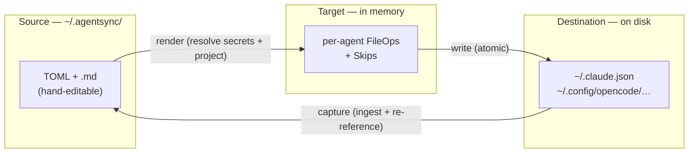
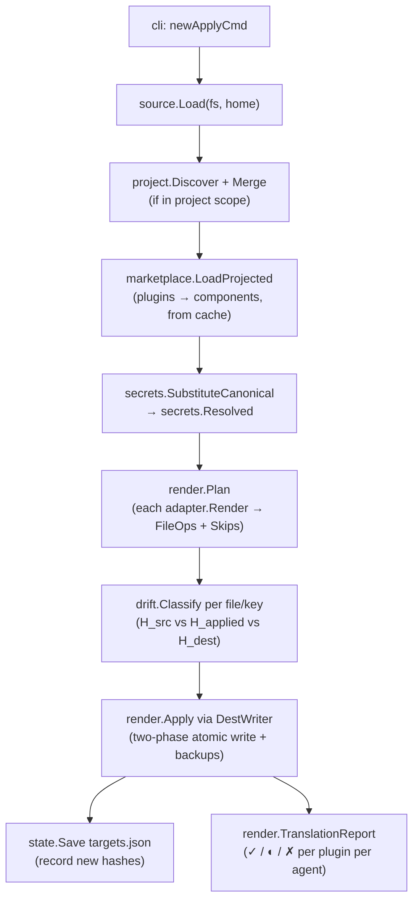
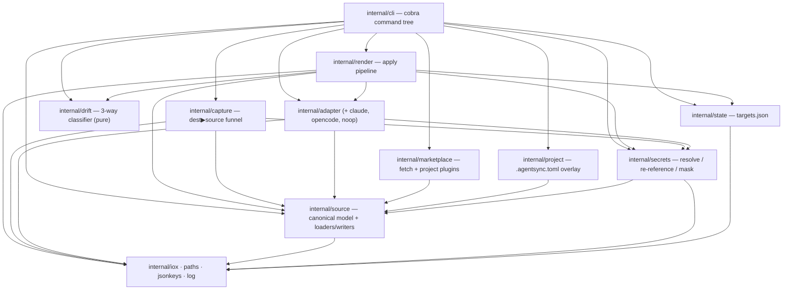

# Architecture

How agentsync is put together: the data model, the apply/capture pipelines, the
drift classifier, and the safety and secrets invariants that make it trustworthy
enough to point at your real config and your real credentials.

If you haven't yet, read [Concepts & glossary](concepts.md) first — this page
assumes that vocabulary. For a package-by-package index, see the
[component map](components.md).

---

## 1. The three-state model

agentsync inherits chezmoi's three-state design. Every operation is a comparison
between **Source** (what you committed), **Target** (what the source renders to,
computed in memory), and **Destination** (what's on disk in each agent).



Drift is a hash comparison against the **last-applied** hashes recorded in
state: if the destination's hash no longer matches what agentsync last wrote, the
file was edited outside agentsync.

---

## 2. The canonical model *is* the schema

There is no separate internal IR. The Go structs in `internal/source` that parse
the TOML/markdown in `~/.agentsync/` are the canonical model
(`source.Canonical`), and adapters render directly from it. Adding a component
field means changing those structs; adding an agent means adding an adapter that
consumes them — the schema is the contract between the two.

```
source.Canonical
├── Config          (agentsync.toml: agents, update defaults, secrets backend)
├── MCPServers      (mcp/*.toml)
├── Skills          (skills/*/SKILL.md)
├── Subagents, Commands, Hooks, LSPServers
├── Plugins, Marketplaces   (plugins/*.toml, marketplaces/*.toml)
├── Memory          (memory/AGENTS.md + fragments/)
└── Project         (.agentsync.toml overlay, when in project scope)
```

---

## 3. The adapter contract

Every agent integration implements one interface (`internal/adapter/adapter.go`):

```go
type Adapter interface {
    Name() string
    Capabilities() Capability       // bitmask: MCP, Memory, Skill, Subagent, Command, Hook, LSP
    Detect() (bool, error)          // is this agent installed?
    Render(r secrets.Resolved, scope Scope, project string) ([]FileOp, []Skip, error)
    Ingest(scope Scope, project string) (source.Canonical, error)
    KeyMergeStrategy() string       // "merge-json-keys" | "merge-jsonc-keys" | ""
    Apply(ops []FileOp, w DestWriter) error
}
```

Two design points worth internalizing:

- **`Render` accepts only `secrets.Resolved`, never a raw `source.Canonical`.**
  `Resolved` is a wrapper type produced by secret substitution; you cannot pass
  the templated source model to `Render`, and you cannot pass the resolved
  (cleartext) model to a source writer. This makes "leak a resolved secret back
  into source" a *compile error*, not a code-review check.
- **Every destination write goes through `DestWriter`.** Adapters never call
  `iox.AtomicWrite`/`os.Remove` directly. `DestWriter` owns the
  foreign-collision backup invariant (back up any pre-existing file agentsync
  doesn't yet own, before overwriting). A `forbidigo` lint rule fails any direct
  write outside the allowed packages, so a new adapter can't regress the backup
  guarantee.

`Capability` is a bitmask, so the OpenCode adapter simply omits `CapHook` and
`CapLSP` and the pipeline reports those components as skipped.

One **optional** extension sits beside the core interface:

```go
type PluginIngester interface {
    IngestPlugins(scope Scope, project string) ([]NativeMarketplace, []NativePlugin, error)
}
```

An adapter implements it only if the agent tracks installed plugins +
marketplaces in its native config (Claude reads `enabledPlugins` /
`extraKnownMarketplaces` from `settings.json`). `import` type-asserts for it: an
adapter that doesn't implement it imports no plugins. It's kept off the core
`Adapter` because the canonical schema doesn't otherwise depend on a native
plugin concept, and only Claude has one in v1. The CLI maps each result onto an
agentsync marketplace source and re-fetches it through the same code path as
`marketplace add` + `plugin install`, so a captured plugin lands as a normal
`plugins/<id>.toml` + `marketplaces/<name>.toml` pair with a pinned manifest SHA.

---

## 4. The apply pipeline (Source ▶ Destination)

`agentsync apply` is local-only and offline. It renders from the cache that
`agentsync update` populated.



Key stages:

1. **Load** the canonical source (`internal/source`).
2. **Overlay** the project marker if the apply is project-scoped (`internal/project`).
3. **Project plugins** into components from the local cache (`internal/marketplace`).
4. **Resolve secrets** — `${secret:…}`/`${env:…}` → `secrets.Resolved` (`internal/secrets`).
5. **Plan** — each enabled adapter renders the resolved model into `FileOp`s and
   `Skip`s (`internal/render`, `internal/adapter/*`).
6. **Classify** each file/key with the 3-way drift classifier (`internal/drift`).
7. **Write** through `DestWriter` with two-phase atomic writes and
   foreign-collision backups (`internal/render`, `internal/iox`).
8. **Record** new hashes in `targets.json` (`internal/state`) and print the
   translation report.

`--dry-run` runs steps 1–6 and prints the plan/report without writing.

---

## 5. The capture pipeline (Destination ▶ Source)

The reverse path — used by `agentsync import` and reconcile's `[w]rite-back` —
goes through exactly one function, `capture.Capture`:


`capture.Capture` is the single dest→source funnel. It **re-references** any
resolved secret back to its `${secret:…}` form before writing, and it preserves
source-only fields (like an MCP server's `agents`/`enabled` list) that the
rendered destination never carried. No other code path writes destination data
back into the source.

Re-reference matches by value, so it cannot distinguish a *moved or rotated*
secret from a deliberate non-secret edit. As a **fail-closed backstop**,
`capture.Capture` re-scans the about-to-be-written model
(`secrets.ResidualSecretCleartext`): if a live vault secret value would still be
written verbatim, or a `${secret:K}` the source referenced has vanished from the
captured group (rotated/edited away), it **refuses the write** rather than risk
persisting cleartext — directing the user to update the vault or edit the source.

---

## 6. Drift — the 3-way classifier

`internal/drift` is a pure function over three hashes. For every managed file or
key:

- `H_src` — computed now from the canonical source
- `H_applied` — recorded last apply in `targets.json`
- `H_dest` — current on-disk content (or nil)

| `H_applied` vs `H_src` | `H_applied` vs `H_dest` | Class | `apply` behavior |
|---|---|---|---|
| = | = | **clean** | noop |
| ≠ | = | **pending** | write `H_src` |
| = | ≠ | **drift** | block; suggest reconcile |
| ≠ | ≠, `H_dest = H_src` | **converged** | refresh state silently |
| ≠ | ≠, all differ | **conflict** | block; require reconcile |
| `H_applied` nil, `H_dest` nil | — | **new** | create |
| `H_applied` nil, `H_dest` ≠ nil | — | **foreign-collision** | back up dest, then write |
| `H_src` nil, `H_applied` ≠ nil | `H_dest = H_applied` | **orphan** | delete |
| `H_src` nil, `H_applied` ≠ nil | `H_dest ≠ H_applied` | **orphan-drifted** | warn |

`drift.SafeForAutoApply(class)` is what `reconcile --auto-safe` consults — it
auto-resolves only the cases that can't lose work (`converged`, `pending`).

**Granularity.** Structured files (JSON/JSONC/TOML) are tracked per **JSON
pointer**, so agentsync can own `$.mcpServers.github` inside `~/.claude.json`
without touching keys it didn't write. Those untouched keys are **foreign keys**
— surfaced in `status` but never entering the classifier. If a structured file
fails to parse, the algorithm degrades to file-level on the whole file.

---

## 7. Safety primitives

All present in v1.0 (`internal/iox`, `internal/render`, `internal/state`):

1. **Two-phase atomic write** — write to `.state/staging/`, fsync, rename onto
   the final path. A crash leaves either the old or the new file, never a partial.
2. **File lock** — `gofrs/flock` on `.state/apply.lock` serializes concurrent
   `apply`/`reconcile`. `apply --dry-run` is read-only and takes no lock.
3. **`AGENTSYNC_TARGET_ROOT`** — every dest path resolves through one helper
   (`internal/paths`), so tests redirect `$HOME` to a tmpdir. A `forbidigo` rule
   bans `os.UserHomeDir()` in `_test.go`.
4. **First-apply backups** — the `foreign-collision` case copies the pre-existing
   destination into `.state/backups/<ts>/` before writing. Symlinked
   destinations are refused by default.
5. **Manifest-SHA pinning** — every plugin records a `tree:v1:` content hash
   over its *entire* cache tree (every projected component body — skills,
   command/subagent markdown — not just `plugin.json`, excluding `.git/`), so a
   re-uploaded version *or* a tampered component body is detected as drift
   rather than silently consumed. (An entry-only plugin with no cached bodies is
   pinned over its marketplace entry.)

---

## 8. Secrets — how the leak is prevented

The dangerous bug class is a *resolved cleartext secret being persisted back
into the canonical source* (often a committed dotfiles repo). agentsync makes
this hard to do by accident with three tiers of defense:

- **Compile-enforced (load-bearing).** `secrets.SubstituteCanonical` returns
  `secrets.Resolved`, a wrapper that is *not* assignable to `source.Canonical`.
  Adapters' `Render` take `Resolved`; source writers and `capture.Capture` take
  only the templated `source.Canonical`. Passing resolved data to a writer is a
  compile error.
- **Value-invariant (load-bearing).** Secret substitution clones the model
  before resolving (no aliasing back to the caller's templated copy), and the
  field walker only visits secret-bearing fields — so text components (memory,
  skills, commands) physically cannot carry a substituted secret.
- **Lint fence (defense-in-depth).** A `forbidigo` rule forbids unwrapping a
  `Resolved` outside the two adapter `Render` egress sites.
- **Capture fail-closed backstop (defense-in-depth).** The *dest→source*
  direction can't be type-enforced (it legitimately writes a templated
  `source.Canonical`), and re-reference matches by value — so a secret *moved*
  into a literal-counterpart field or *rotated* to a vault-unknown value can
  evade restoration. `capture.Capture` re-scans the about-to-be-written model
  (`secrets.ResidualSecretCleartext`) and **refuses to write** if a resolved
  secret would persist, rather than guess.

There is one **accepted residual**: a *deliberate* two-step laundering (defeat
the lint fence to obtain a writable `source.Canonical`, then call a source writer
directly) could leak. No innocent mistake produces it, and `capture.Capture`
always re-references. The single field list lives in `walkSecretFields`
(`internal/secrets/walk.go`); a reflection-based test fails if a new
string-shaped secret-bearing field is added without classification.

> If you ever find yourself unwrapping a `secrets.Resolved` outside an adapter's
> `Render`, stop — you almost certainly want `capture.Capture`. The full set of
> invariants is in [`CLAUDE.md`](../CLAUDE.md) and [`SECURITY.md`](../SECURITY.md).

---

## 9. Network boundary

`agentsync update` is the **only** command that touches the network. It clones
or fetches marketplaces (`go-git`, with a `git` shell-out fallback for sparse
clones) and npm tarballs (registry HTTP, no `npm` binary required), writing them
to `.state/cache/`. Everything else — including `apply` — reads only from that
cache, which keeps `apply` fast, offline, and reproducible in CI.

Untrusted-input hardening at this boundary: fetchers reject symlinks in
tarballs, cap decompressed size (`AGENTSYNC_MAX_TARBALL_MB`), verify manifest
SHAs, bound component paths to the plugin cache, and reject `http://`/`git://`
sources unless `AGENTSYNC_ALLOW_INSECURE_URLS=1`.

---

## 10. Package layering



`internal/drift`, `internal/iox`, `internal/jsonkeys`, `internal/paths`, and
`internal/log` have no internal dependencies — they're the leaves. See the
[component map](components.md) for what each package contains.
