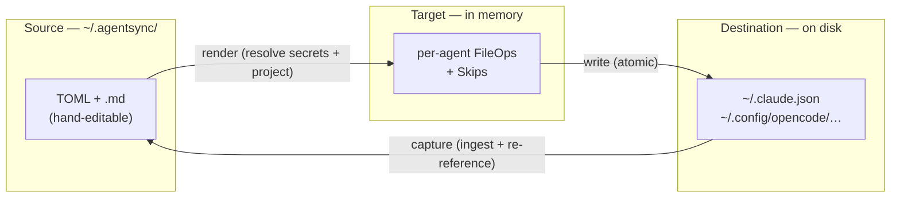
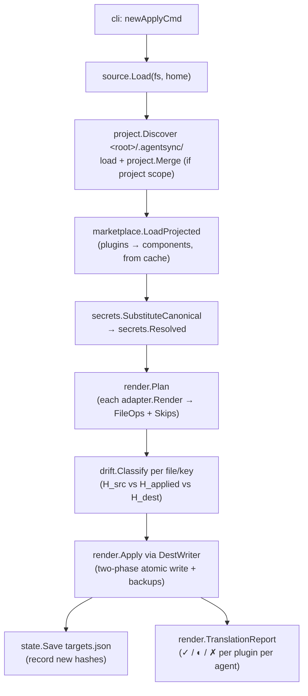
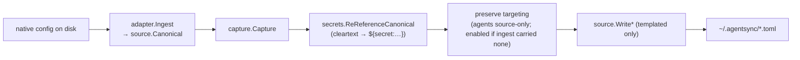
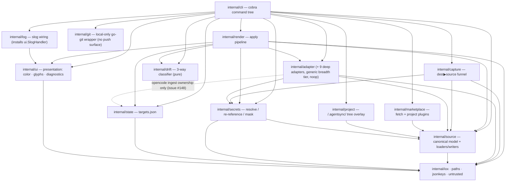

# Architecture

How agentsync is put together: the data model, the apply/capture pipelines, the
drift classifier, and the safety and secrets invariants that make it trustworthy
enough to point at your real config and your real credentials.

If you haven't yet, read [Concepts & glossary](concepts.md) first — this page
assumes that vocabulary. For a package-by-package index, see the
[component map](components.md).

---

## 1. The three-state model

agentsync inherits chezmoi's three-state design. Every operation is a comparison
between **Source** (what you committed), **Target** (what the source renders to,
computed in memory), and **Destination** (what's on disk in each agent).


```mermaid
flowchart LR
    subgraph S["Source — ~/.agentsync/"]
        TOML["TOML + .md<br/>(hand-editable)"]
    end
    subgraph T["Target — in memory"]
        OPS["per-agent FileOps<br/>+ Skips"]
    end
    subgraph D["Destination — on disk"]
        NATIVE["~/.claude.json<br/>~/.config/opencode/…"]
    end
    TOML -- "render (resolve secrets + project)" --> OPS
    OPS -- "write (atomic)" --> NATIVE
    NATIVE -- "capture (ingest + re-reference)" --> TOML
```

Drift is a hash comparison against the **last-applied** hashes recorded in
state: if the destination's hash no longer matches what agentsync last wrote, the
file was edited outside agentsync.

---

## 2. The canonical model *is* the schema

There is no separate internal IR. The Go structs in `internal/source` that parse
the TOML/markdown in `~/.agentsync/` are the canonical model
(`source.Canonical`), and adapters render directly from it. Adding a component
field means changing those structs; adding an agent means adding an adapter that
consumes them — the schema is the contract between the two.

```
source.Canonical
├── Config          (agentsync.toml: agents, update defaults, secrets backend, [memory] banner)
├── MCPServers      (mcp/*.toml)
├── Skills          (skills/<name>/ — SKILL.md + bundled scripts/references/assets)
├── Subagents, Commands, Hooks, LSPServers
├── Plugins, Marketplaces   (plugins/*.toml, marketplaces/*.toml)
├── Memory          (memory/AGENTS.md + fragments/; rendered files get the managed banner — see below)
└── Project         (overlay loaded from a <root>/.agentsync/ tree, project scope)
```

At **project scope** the same canonical is loaded a second time from the repo's
`<root>/.agentsync/` tree (identical layout) and overlaid onto the user canonical
by `project.Merge`: entries are merged by id/name (project wins), project memory
is appended, and a project `plugins/<id>.toml` with `disabled = true` is excluded
from projection in that repo. The project's `[agents]` table is **authoritative**
— `project.Merge` never inherits the user's enabled agents, so identical
committed source renders identically for every collaborator. An empty or absent
project `[agents]` is rejected before render by `requireProjectAgents`
(`internal/cli`), which every scope-aware command reaches via
`loadProjectedForScope` (`check` calls it on its own load path); the error
points at `agentsync agent add <name> --scope project`. `import --scope project`
is deliberately exempt: it is the capture path used to bootstrap a tree. The retired M5 single-file `.agentsync.toml` marker is no longer
read — `project.Discover` surfaces a migration error if it finds one.

**Managed memory banner.** Every rendered memory file (`CLAUDE.md`, `AGENTS.md`,
…) is prepended with a short agentsync notice naming the file and pointing edits
back at `.agentsync/memory/AGENTS.md` + `agentsync apply`. Every adapter renders
memory through the one helper `source.RenderManagedMemory` (which wraps
`ExpandMemoryImports`), so the banner is byte-identical across agents. It is a
property of the *rendered destination file only* — it is wrapped in reversible
`<!-- agentsync:managed memory-banner -->` markers (the `agentsync:managed`
namespace carries a per-marker identifier so future managed markers stay
unambiguous) and stripped by `source.StripManagedBanner`
on the way back in (each adapter's ingest, plus a backstop at the `import` /
`reconcile` write-back funnels), so it never enters the canonical source and never
compounds. Because the banner text is static (only the filename varies) it hashes
identically on every render, so an untouched file still classifies `InSync` — the
banner never manufactures drift. It is on by default; `[memory] banner = false`
in `agentsync.toml` opts out (the project overlay inherits the user setting unless
it sets its own). The `agentsync:managed` marker is **reserved**: `checkReservedMarkers`
(in `loadMemory` and `WriteMemory`) rejects a canonical whose body or a fragment
carries it rather than letting it collide with the banner's markers, and
`StripManagedBanner` matches agentsync's full rendered banner (not the bare
markers) so it removes only agentsync's own banner — a user-authored marker block
is preserved, never deleted.

---

## 3. The adapter contract

Every agent integration implements one interface (`internal/adapter/adapter.go`):

```go
type Adapter interface {
    Name() string
    Detect() (bool, error)          // is this agent installed? (informational; consumed by `doctor`)
    Render(r secrets.Resolved, scope Scope, project string) ([]FileOp, []Skip, error)
    Ingest(scope Scope, project string) (source.Canonical, error)
    KeyMergeStrategy() string       // "merge-json-keys" | "merge-jsonc-keys" | "merge-toml-keys" | ""
    Apply(ops []FileOp, w DestWriter) error
}
```

Two design points worth internalizing:

- **`Render` accepts only `secrets.Resolved`, never a raw `source.Canonical`.**
  `Resolved` is a wrapper type produced by secret substitution; you cannot pass
  the templated source model to `Render`, and you cannot pass the resolved
  (cleartext) model to a source writer. This makes "leak a resolved secret back
  into source" a *compile error*, not a code-review check.
- **Every destination write goes through `DestWriter`.** Adapters never call
  `iox.AtomicWrite` or the destructive `os.*` family
  (`os.Remove`/`os.RemoveAll`/`os.WriteFile`/`os.Create`) directly. `DestWriter`
  owns the foreign-collision backup invariant (back up any pre-existing file
  agentsync doesn't yet own, before overwriting). A `forbidigo` lint rule — plus a
  belt-and-braces source-scanning test (`internal/render/writer_lint_test.go`) —
  fails any direct write outside the allowed non-destination packages, so a new
  adapter can't regress the backup guarantee.
- **Project scope requires a project root.** Each adapter's `ResolvePaths` falls
  through to *user*-scope paths when the project root is empty, so a
  `(ScopeProject, "")` call would silently write the project overlay into the
  user's global config. Every scope-resolving adapter method —
  `Render`, `Ingest`, and `IngestPlugins` — calls `adapter.RequireProjectRoot`
  first thing and returns `ErrProjectRootRequired` instead — a loud failure at
  the narrowest waist rather than a silent wrong-scope I/O. The CLI's
  `resolveScope` already guarantees a non-empty root for project scope, so this
  is defense-in-depth against a future or non-CLI caller.
- **Ingest treats only `os.IsNotExist` as "component absent."** A native config
  file (or component directory) the user never created is a silent skip; any
  *other* read or parse error on a *present* file — a permission error, an
  `EISDIR`, transient I/O, or a corrupt `settings.json`/`config.toml` — is
  returned, so a transient failure never reads as an empty component that drift
  could misclassify as "the user cleared it" and reconcile could then write back
  as nothing over the canonical source. The shared `adapter.ReadFileOptional` /
  `adapter.ReadDirOptional` helpers enforce this absent-vs-error split uniformly
  across every adapter's `Ingest` (a per-entry read inside a component-directory
  loop stays a deliberate skip, surfaced as a warning where a warn sink exists).

**Component support is expressed by what `Render` emits, not a capability
declaration.** When an agent has no native target for a component, its `Render`
returns a `[]Skip` entry for that component rather than a `FileOp` — there is no
separate capability bitmask to keep in sync with the render logic. So the
OpenCode adapter reports Hook and LSP as skips; Claude, Codex, Cursor, and the
other v1 adapters report LSP as a skip too (Claude Code reads LSP servers from
plugin manifests rather than `settings.json`, and agentsync does not synthesize
Claude plugins in v1; the others have no native LSP config concept).

**Skips are typed, not stringly-classified.** A `Skip` carries a `Kind`
(`adapter.SkipKind`): `SkipDropped` when the whole component had no native target
and was not emitted, `SkipReduced` when it rendered but lost fields the agent has
no home for (a subagent's Claude-only `tools`/`color`, a command's frontmatter).
The adapter that builds the `Skip` sets `Kind` — the CLI's `plugin explain` reads it
directly and `explain --json` surfaces it as `kind` (`"reduced"`/`"dropped"`).
The zero value `SkipKindUnset` is invalid: `Component` is the plain kind (`mcp`,
`subagent`, …) and no longer encodes the distinction via a `-frontmatter` suffix.
Two complementary guards make an unclassified skip impossible to ship.
`TestEverySkipLiteralSetsKind` (`internal/adapter`) statically parses every
production `adapter.Skip` literal under `internal/` and fails if one omits `Kind`
— reachability-independent, so a skip site gated on a path that is never empty at
runtime (e.g. a scope-gap branch) cannot hide from it. `TestEveryAdapterClassifiesSkips`
(`internal/cli`) is the behavioral complement: it renders every registered
adapter at both scopes, fails on any unset `Kind`, and pins that both kind values
are exercised.

**Key-merge strategies and on-disk format.** `KeyMergeStrategy` /
`FileOp.MergeStrategy` name how an adapter co-owns keys inside a shared config
file: `merge-json-keys` (Claude's `.claude.json`/`settings.json`, a project's
repo-root `.mcp.json` for project-scope MCP servers, Cursor's `.cursor/mcp.json` +
`.cursor/hooks.json`, Windsurf's `~/.codeium/windsurf/mcp_config.json`, Roo's project `.roo/mcp.json`,
and Cline's `~/.cline/mcp.json`),
`merge-jsonc-keys` (OpenCode's comment-tolerant `opencode.json` and Gemini's
`.gemini/settings.json` — which co-owns both `mcpServers` and `hooks`), and
`merge-toml-keys` (Codex's `config.toml`). The Continue adapter co-owns no shared
file (it projects one block file per item), so it has no key-merge strategy.

Each adapter has **exactly one** key-merge strategy. `orphanCleanupOps`
(`internal/render/pipeline.go`) synthesizes destructive cleanup writes from the
single, static `KeyMergeStrategy()` value and applies it to *every* key-merge
destination the adapter owns, so an adapter co-owning keys across files of
*different* on-disk formats is **not currently supported** — it would require
widening the accessor to a per-path strategy first. A central guard
(`TestKeyMergeStrategy_MatchesEmittedOps`, `internal/cli`) renders a real
MCP+hook fixture through every registered adapter and pins `KeyMergeStrategy()`
against the `MergeStrategy` stamped on every key-merge `FileOp` it emits, so the
accessor can never silently drift from what an adapter actually writes.

**Deep vs breadth-tier adapters.** The nine hand-written packages above are
*deep* adapters — agent-specific, multi-component, often bidirectional. Beyond
them, a single data-driven *generic* adapter (`internal/adapter/generic`) serves a
long tail of agents from a verified `Spec` table — memory, (where expressible)
MCP, and (where the agent scans a `SKILL.md` directory) Agent Skills, every other
component reported as a skip. Both kinds implement the same
`Adapter` interface and register identically, so the rest of the pipeline (plan,
classify, write, capture, state) treats them uniformly. The set of valid agent
names is derived from the deep package list **plus** `generic.Specs()` (see
`internal/cli/agent.go` `allAgentNames`), so adding a breadth agent — a verified
table row — needs no change to validation, `doctor`, or `init`. The merge *currency* is always a
`map[string]any` decoded from the rendered op's JSON `Content`, so the
pipeline's pointer/ownership machinery (owned-key synthesis, orphan cleanup,
per-pointer state hashing, foreign-collision backup) is format-agnostic; only
the destination *file* is decoded/encoded per strategy — TOML for
`merge-toml-keys` (`internal/adapter/codex/settings.go`), JSON otherwise. As
with `opencode.json` and `mcp/*.toml`, the TOML round-trip does not preserve
comments in the rewritten file (a documented v1 limit).

### PluginIngester (read-only)

One **optional** extension sits beside the core interface:

```go
type PluginIngester interface {
    IngestPlugins(scope Scope, project string) ([]NativeMarketplace, []NativePlugin, error)
}
```

An adapter implements it only if the agent tracks installed plugins +
marketplaces in its native config (Claude reads `enabledPlugins` /
`extraKnownMarketplaces` from `settings.json`; Codex reads
`[plugins."<name>@<source>"]` enable-state from `config.toml`). `import`
type-asserts for it: an adapter that doesn't implement it imports no plugins.
It's kept off the core `Adapter` because the canonical schema doesn't otherwise
depend on a native plugin concept (OpenCode has no plugins; the Cursor adapter
has them but its enable-state location is undocumented, so it implements no
`PluginIngester` yet).

#### The asymmetry is the invariant — read-only by design

PluginIngester has **no `Render`-side counterpart**, and `Adapter.Render` MUST
NOT emit plugin-enablement or marketplace-registry metadata back into the
native config. This is the rule for every adapter, present and future:

> **`import` reads the agent's plugin enable-state for discovery; `apply`
> never writes it back. Apply fans out the plugin's _components_, not the
> plugin itself.**

Concretely, for each adapter:

| direction       | what crosses the boundary                                                                                      |
|---|---|
| **import** (`Adapter` → canonical via `IngestPlugins`) | enable-state + marketplace sources, so agentsync can fetch the same plugins and own them in `~/.agentsync/plugins/`, `~/.agentsync/marketplaces/` |
| **apply** (canonical → `Adapter` via `Render`)         | **only the plugin's projected components** — its skills go to the agent's skills path, its MCP server to `mcpServers`, its commands to the commands path, etc. **Never `enabledPlugins`, never `extraKnownMarketplaces`, never `[plugins."x@y"]`.** |

Why the asymmetry rather than a tidy round-trip:

- **Plugin identity dissolves at the projection boundary.** Once a plugin's
  skills land at `~/.claude/skills/<name>/`, its MCP entry under `mcpServers`,
  its commands at `~/.claude/commands/<name>.md`, the consumer agent reads
  them through the same code path it uses for hand-authored components. It
  does not need plugin-manager metadata to *use* a projected skill — the
  plugin grouping is purely agentsync's internal bookkeeping.
- **Ownership stays singular.** agentsync is the source of truth for which
  plugins exist. The consumer agent's plugin manager is the source of truth
  for whatever *the agent itself* installed locally. Writing
  `enabledPlugins` back would blur this and pick a fight with the agent's
  own UI: every user `/plugin disable` would be reverted by the next apply
  (a ping-pong loop).
- **No double-install.** If agentsync also wrote `enabledPlugins/X = true`,
  the consumer agent would keep its own copy under
  `~/.claude/plugins/<id>/...` alongside agentsync's projection at the
  shared path — two copies of the same skill, served by different code
  paths, with the agent's UI free to upgrade/disable one but not the other.

The CLI's `import` maps each `NativePlugin` result onto an agentsync
marketplace source and re-fetches it through the same code path as
`marketplace add` + `plugin add`, so a captured plugin lands as a normal
`plugins/<id>.toml` + `marketplaces/<name>.toml` pair with a pinned manifest
SHA. From then on, the projection layer drives every apply.

#### Per-adapter

The **Codex** adapter implements `IngestPlugins`; **Cursor** has a native plugin
system too but does not implement it yet (its enable-state location is
undocumented — see below). Both Codex and Claude project a plugin's components to
every enabled agent via its capability matrix, and both follow the
read-only-on-import, components-only-on-apply rule above:

- **Claude** reads `enabledPlugins` / `extraKnownMarketplaces` on `import` and
  deliberately leaves both keys untouched on `apply`. Foreign entries
  (plugins the user enabled directly in Claude Code, marketplaces the user
  added by hand) are preserved by the merge-keys writer because the render
  doesn't claim those keys.
- **Codex** records enable-state in `~/.codex/config.toml` under
  `[plugins."<name>@<source>"]` tables — the same `name@source` shape Claude
  uses. `IngestPlugins` parses those TOML tables into `NativePlugin` records.
  Unlike Claude, Codex records no marketplace *fetch source* in a documented
  config location, so it returns no `NativeMarketplace`s; `import` resolves
  each plugin's marketplace from agentsync's own registered marketplaces
  (warning + skipping any it can't), exactly the path Claude's
  auto-available built-in marketplace takes. The Codex render never emits
  the `[plugins."x@y"]` tables back, matching the Claude rule.
- **OpenCode**, **Gemini CLI**, **Continue**, **Windsurf**, **Roo Code**, and
  **Cline** have no native plugin concept agentsync models (Gemini uses
  extensions; Continue composes Hub + local blocks), so they implement neither
  side — all still *receive* plugin-projected components (skills, MCP, …) on
  `apply` like every other component, because that's the whole point.
- **Cursor** ships a real adapter (MCP, memory, skills, subagents, commands,
  hooks) but implements no `PluginIngester` yet. Its plugin *content* schema —
  `.cursor-plugin/plugin.json` + `.cursor-plugin/marketplace.json`, near-identical
  to Claude's `.claude-plugin/*` (rules, skills, agents, commands, hooks, MCP) —
  means the projection layer largely transfers, but where Cursor records local
  *enable-state* is undocumented (possibly app-local like its user rules), so
  plugin discovery on `import` is deferred. When that location is identified the
  Cursor adapter implements `PluginIngester` for it — and, by the same invariant,
  still never renders it back. It already *receives* plugin-projected components
  on `apply` like every other adapter.

See the capability matrix for source links.

### Plugin component namespacing

`LoadProjected` flattens every enabled plugin's components into one canonical
model, and adapters derive each destination path from the component's `Name`. So
two plugins shipping a same-named component render two files at one path — a
real, stock case: `feature-dev` and `pr-review-toolkit` (both official Claude
plugins) each ship `agents/code-reviewer.md`. Apply refused, correctly, since
silently keeping one is data loss. But both files live under the
marketplace-managed plugin cache, so the remedy the error named — "rename one" —
was one the user structurally could not perform (issue #211).

**A plugin-provided subagent, skill, or command is therefore renamed to
`<plugin>-<name>` at projection**, in `marketplace.namespaceProjected`, which
also stamps `Plugin` (the providing plugin's id) and `BaseName` (the upstream
name) onto the component. Three consequences worth knowing:

- **It is not an adapter concern, structurally.** Provenance is dropped when
  `loadProjected` appends each plugin's components into flat slices, so by the
  time an adapter can *detect* a collision, the information needed to *resolve*
  it is gone. Rewriting `Name` (rather than teaching each adapter an "effective
  name") is also what keeps every render site correct with no adapter change.
- **The frontmatter `name` key is rewritten in step, when present.** Renaming
  only the file would leave the components colliding anyway: Codex's `name` *is*
  the agent's identity and the Codex adapter prefers it over the file stem, and
  Claude's Agent Skills require the frontmatter `name` to match the skill
  directory. An absent `name` stays absent, so this never invents an identity the
  upstream artifact did not declare.
- **Hand-authored components are never renamed.** `Plugin`/`BaseName` are empty
  for them. Note this is not the same as "a plugin can never take your name": the
  derived name is not injective, so a plugin CAN land on a name you chose. That
  residual is caught and reported by `checkProjectedConflicts` (below), never
  silently resolved in the plugin's favour.

The separator is a hyphen because Claude Code documents a subagent `name` as a
"Unique identifier using lowercase letters and hyphens" — its familiar
`plugin:agent` form is a *scoped identifier* Claude Code derives from the plugin
directory, never a `name` value, and `:` is rejected by
`source.ValidateComponentID` (it becomes a filename, and a colon is illegal on
Windows). A plugin id comes from a marketplace, outside agentsync's trust
boundary, so every derived name is re-validated through that same write-boundary
sanitizer before it can reach a path or a diagnostic.

MCP and LSP servers are deliberately **not** renamed. They are id-keyed and
already covered by `checkProjectedConflicts`, whose hard failure on a same-id
divergence is a security property: two sources claiming one server id can be a
silent endpoint hijack, which is a case to refuse rather than to rename apart.
They ARE stamped with provenance, so the capture paths can still refuse them.
Hooks have no name key at all.

**The derived name is not injective, so the collision guard stays.** Plugin `a`
shipping `b-c` and plugin `a-b` shipping `c` both derive `a-b-c`, and a user who
hand-authors `feature-dev-code-reviewer` collides with what plugin `feature-dev`
derives. `checkProjectedConflicts` therefore guards name-keyed components exactly
as it guards MCP/LSP ids — fatal for the mutating loads, a warning for the lenient
read-only ones — and its message names each side's origin (the providing plugin,
or the user's own canonical file). Without it those cases reach the render
pipeline, where divergent content aborts with a message that can name neither
origin (a `FileOp` carries no provenance) and **identical content is silently
deduped**, dropping a component with no report at all. The silent drop is the
reason the guard exists; the loud one it merely makes actionable.

Namespacing itself never fails. An earlier revision validated the derived name at
projection and returned an error — a regression, because the projection's own
`validateProjectedName` permits `:` and control runes, and because `loadProjected`
propagates a projection error regardless of `lenient`, taking down the read-only
commands whose whole design is to degrade and show state. The name safety lives
downstream at the single dispatch waist, where `render.Plan` runs
`ValidateComponentID` over every component id before any of them is joined into a
destination path.

The rename happens once, on the first apply after upgrading, so `apply` reclaims
the pre-rename destination files it previously wrote — see
[§7 Safety primitives](#7-safety-primitives). Without that, a stale
`~/.claude/agents/code-reviewer.md` would sit beside the two namespaced files and
Claude Code would load it, leaving the user with *more* duplicate agents than
before.

### WarnEmitter (optional)

A second optional extension lets callers redirect the warnings an adapter's
`Ingest` emits (lenient-YAML notices, dropped components, …) away from
`os.Stderr`:

```go
type WarnEmitter interface {
    SetStderr(w io.Writer)
}
```

Concrete adapters (claude/opencode/codex) implement it; the noop adapter
doesn't (it emits no warnings). Four contract rules every implementor
honours:

1. **`SetStderr(nil)` resets to the default** (`os.Stderr`) — and MUST
   NOT panic. Pinned by per-adapter `TestSetStderr_NilResetsToDefault`
   tests that capture `os.Stderr` via a pipe and assert the warning
   actually lands there — a faulty `SetStderr(nil)` routing to
   `io.Discard` would not pass.
2. **Configure stderr BEFORE Ingest.** Adapters snapshot the writer at
   Ingest entry (`warn := a.stderr()`), so calling `SetStderr` mid-Ingest
   is ignored for the remainder of that call. The `RouteTo`-before-Ingest
   pattern is the supported one; don't depend on dynamic switching.
3. **Compile-pin against `adapter.WarnEmitter`.** Each adapter's
   `claude_test.go` / `opencode_test.go` / `codex_test.go` carries a
   `var _ adapter.WarnEmitter = a` line so dropping the method fails
   the test build, not a runtime no-op.
4. **The writer's lifetime is the caller's problem.** Today's caller
   (`import`) uses the restore-handle pattern —
   `defer warnW.RouteTo(a)()` evaluates the inner `RouteTo(a)` immediately
   (wires the writer) and defers the returned restore closure (calls
   `SetStderr(nil)` on the way out) — paired with `defer warnW.Flush()`
   to drain any partial line in the WarnWriter's line-assembly buffer.

`import` is the only caller today: it wraps `cmd.ErrOrStderr()` in a
`ui.WarnWriter` that restyles `"warning: "` line prefixes to bold-yellow
`"⚠️ warning:"`, then `defer warnW.RouteTo(a)()` injects the wrapper
and arranges the restore. The same wrapper backs `capture.Opts.Warn`
and the command's own `io.warn` calls, so every warning the user sees
during an import — adapter, capture, or CLI — shares one styling.

Kept off the core `Adapter` for the same reason as `PluginIngester`: an
adapter that emits no Ingest warnings shouldn't be forced to implement a
setter it'll never use.

### VersionedDirs (optional)

A third **optional** extension lets an adapter declare the on-disk directories the
apply tail should keep in a local-only git rollback history (issue #118, step 9
below):

```go
type VersionedDirs interface {
    VersionRoots(scope Scope, project string) []string
}
```

It is **read-only** and does not widen the `Render`/`Apply` contract — it only
reports directories to back up. The contract every implementor honours:

1. **`ScopeProject` MUST return nil.** Project destinations live inside the user's
   own project repo and are left to that repo's source control; git backup is a
   user-scope-only feature. (`project.Merge` drops any project
   `[destination_directory_git_backup]` override for the same reason.)
2. **The unit is the directory, not the agent.** An adapter returns its own config
   dir **plus** any shared cross-agent dir it writes into — Codex and several
   breadth agents all write skills to `~/.agents/skills`; OpenCode writes skills to
   `~/.claude/skills`. The apply tail **unions** these across every enabled adapter,
   **de-nests** them (drops a root nested under another — never a repo inside a
   repo), and **de-dups** them (a shared dir is one repo, checkpointed once).
3. **Paths are absolute, after `AGENTSYNC_TARGET_ROOT` redirection** — they match
   the `FileOp.Path` values the adapter emits, so tests redirect `$HOME` uniformly.
4. **`$HOME`-level strays are excluded.** A deep agent may also write a top-level
   file outside any returned dir (Claude's `~/.claude.json`); those are
   intentionally **not** versioned — agentsync never inits a repo at `$HOME`.

An adapter with no versionable directory (e.g. `noop`) does not implement it. The
apply tail's use of these roots is the step-9 narrative in §4.

### HookIngestGuard and HookEventNamer (optional)

Two further **optional** extensions serve `import`'s stale-hook retirement
(the second-order issue #124 fix — a hook event captured while clean and later
enriched natively must not leave a stale canonical `hooks/<event>.toml` that
the next apply rewrites lossily):

```go
type HookIngestGuard interface {
    RefusedHookEvents(scope Scope, project string) ([]string, error)
}
type HookEventNamer interface {
    NativeHookEvent(canonical string) (string, bool)
}
```

- **`HookIngestGuard`** (claude, gemini, cursor, codex — every hook-rendering
  adapter) re-reads the destination and returns the hook events ingest
  *semantically* refused: unmodeled fields on well-formed entries, plus
  non-command handlers where the adapter's render cannot round-trip them
  (claude, gemini, cursor); codex re-renders non-command types verbatim, so
  it refuses unmodeled fields only.
  Structurally-malformed shapes (a settings.json typo) are excluded, because
  import deletes the canonical file for every returned event and a native
  typo must never be destructive.
  Returned names are always *canonical*: a renaming adapter maps its refused
  native spellings back (gemini `BeforeTool` → `PreToolUse`, cursor
  `preToolUse` → `PreToolUse`), and a native-only event (`BeforeModel`,
  `afterFileEdit`, …) is never returned — no canonical file exists to retire.
  The registry-wide guard `TestHookIngestGuard_ReportsCanonicalNames`
  (`internal/cli`) enforces the canonical-spelling half of that contract for
  every implementor; the never-return-a-native-only-event half stays pinned
  per-adapter (no native-only event can exist in the guard's
  canonical-rendered fixture, so each adapter's guard table carries its own
  "native-only event is never refused" row).
- **`HookEventNamer`** (gemini, cursor) reports the *native* spelling an
  adapter uses in its owned `/hooks/<name>` pointers (`PreToolUse` →
  `BeforeTool` / `preToolUse`). Canonical hooks are **shared** across agents,
  so a retirement disowns every agent's state key for the event at that scope
  — and a renaming agent's key is only findable under its native spelling.
  An adapter that renames without declaring would silently escape the disown
  and the next apply's orphan cleanup would delete the event from its native
  config; the registry-wide guard
  `TestHookEventNamer_CoversEveryRenamedPointer` (`internal/cli`) makes that
  state unrepresentable.

---

## 4. The apply pipeline (Source ▶ Destination)

`agentsync apply` is local-only and offline. It renders from the cache that
`agentsync plugin outdated` populated.


```mermaid
flowchart TD
    A["cli: newApplyCmd"] --> B["source.Load(fs, home)"]
    B --> P["project.Discover &lt;root&gt;/.agentsync/<br/>load + project.Merge (if project scope)"]
    P --> C["marketplace.LoadProjected<br/>(plugins → components, from cache)"]
    C --> SEC["secrets.SubstituteCanonical<br/>→ secrets.Resolved"]
    SEC --> REN["render.Plan<br/>(each adapter.Render → FileOps + Skips)"]
    REN --> CL["drift.Classify per file/key<br/>(H_src vs H_applied vs H_dest)"]
    CL --> W["render.Apply via DestWriter<br/>(two-phase atomic write + backups)"]
    W --> ST["state.Save targets.json<br/>(record new hashes)"]
    W --> RPT["render.TranslationReport<br/>(✓ / ◐ / ✗ per plugin per agent)"]
```

Key stages:

1. **Load** the canonical source (`internal/source`).
2. **Overlay** the project source tree (`<root>/.agentsync/`) if the apply is
   project-scoped — load it and `project.Merge` it onto the user canonical (`internal/project`).
3. **Project plugins** into components from the local cache (`internal/marketplace`).
4. **Resolve secrets** — `${secret:…}`/`${env:…}` → `secrets.Resolved` (`internal/secrets`).
5. **Plan** — each enabled adapter renders the resolved model into `FileOp`s and
   `Skip`s (`internal/render`, `internal/adapter/*`).
6. **Classify** each file/key with the 3-way drift classifier (`internal/drift`).
7. **Write** through `DestWriter` with two-phase atomic writes and
   foreign-collision backups (`internal/render`, `internal/iox`).
8. **Record** new hashes in `targets.json` (`internal/state`) and print the
   translation report.
9. **Git-backup** (issue #118) — for a user-scope apply, checkpoint each destination
   **directory** into its own **local-only** git repo (`internal/cli/gitbackup.go`
   → `internal/git`). The unit is the directory, not the agent: every enabled
   adapter declares its version roots via the optional `adapter.VersionedDirs`
   extension (its config dir plus any shared cross-agent dir it writes — Codex and
   several breadth agents all target `~/.agents/skills`; OpenCode targets
   `~/.claude/skills`). The apply tail **unions** those roots, **de-nests** them
   (drops a root nested under another, so there's never a repo inside a repo), and
   **de-dups** them (a shared dir is one repo, checkpointed once with all its files
   regardless of how many agents wrote there). De-nesting only sees the current
   run's roots, so before initializing a dir agentsync also scans the filesystem
   (`git.HasNestedRepoBelow`) and **refuses to init a repo that would wrap an
   existing one** — the cross-run case where a child dir was versioned before a
   parent-dir agent was enabled. That same scan (symlink-aware — it shallow-probes a
   symlinked subdir's target for a `.git`) is **re-run on every later path that
   assumes the work tree is wholly agentsync's**: the commit path **warns** if a
   foreign repo has appeared under an owned root (the append-only checkpoint is still
   recorded), `agentsync revert` **refuses/skips** such a root before its destructive
   hard reset (an error under `--strict`), and `doctor` downgrades a `StateUntracked`
   root that contains a nested `.git` to a **warn** so its report matches what apply
   does. The managed-file set committed under
   each root is the `written` set from step 7 plus any tracked deletions; `$HOME`-
   level strays (Claude's `~/.claude.json`) are never versioned (agentsync never
   inits a repo at `$HOME`). This step is **best-effort** (the files are already
   written and state already saved, so a git failure never fails the apply),
   **opt-out** (the `[destination_directory_git_backup]` mode — `prompt`/`on`/`off`
   — plus the `apply --no-git-backup` per-run bypass), and **never pushes**:
   `internal/git`'s own API exposes no remote/push calls, enforced by
   `TestNoPushSurface` — a **source-scanning convention guard** (a grep over the
   package's non-test `.go` files for banned remote/push tokens), not a type-level
   impossibility. The go-git `*Repository` that `Repo` holds still has
   `Push`/`CreateRemote`, so this is a convention guard (a struct-shape or
   reflection change could defeat the scan), in the same spirit as the secrets lint
   fence (§8 / `SECURITY.md`). `agentsync revert` (which takes
   the same global lock apply holds) rolls a dir back to a prior checkpoint
   append-only. Snapshotting uncommitted hand-edits to tracked files is enforced
   **inside the engine `Restore`** (safe-by-construction for every caller, not just
   the CLI wrapper), so the rollback can't lose them; a partial-reset failure after
   that snapshot surfaces a **recovery hint** naming the pre-revert HEAD and the
   snapshot commit. `.state/` is **untouched** by this step — the two are
   complementary (operational memory vs. user-facing rollback history).

`--dry-run` runs steps 1–6, then a non-writing pass of step 7 (the writer's merge
+ convergence check, no disk write) so it can label each destination `✓ synced`
vs `→ write` and preview foreign-collision backups, and prints the plan/report —
all without writing a byte (and it skips the git-backup step 9 entirely).

---

## 5. The capture pipeline (Destination ▶ Source)

The reverse path — used by `agentsync import` and reconcile's `[w]rite-back` —
goes through exactly one function, `capture.Capture`:


```mermaid
flowchart LR
    NATIVE["native config on disk"] --> ING["adapter.Ingest<br/>→ source.Canonical"]
    ING --> CAP["capture.Capture"]
    CAP --> RR["secrets.ReReferenceCanonical<br/>(cleartext → ${secret:…})"]
    RR --> PRES["preserve targeting<br/>(agents source-only; enabled if ingest carried none)"]
    PRES --> WR["source.Write* (templated only)"]
    WR --> SRC["~/.agentsync/*.toml"]
```

`capture.Capture` is the single dest→source funnel. It **re-references** any
resolved secret back to its `${secret:…}` form before writing, and it preserves
the server targeting the destination doesn't fully carry: an MCP/LSP server's
`agents` list is source-only (no native dest carries it) and is always restored,
while `enabled` — which some destinations *do* carry (Codex reads a native
`enabled` back, issue #152) — is restored from source only when the ingest carried
none, so a real native enable/disable round-trips instead of being reset. It also
**normalizes numeric passthrough values**: adapter ingests decode native JSON/JSONC
with `UseNumber`, and a `json.Number` left in an MCP/LSP `Extra` map would be
marshaled by go-toml as a TOML *string* (`timeout = '30'`), silently flipping the
value's native type on the next render — so Capture converts every `json.Number`
to `int64`/`float64` before writing. No other
code path writes destination data back into the source. (Two guarded code paths
*delete* canonical files without going through Capture: `reconcile`'s
`removeDroppedSource` unlinks `mcp/<id>.toml` when the user writes back a
destination-side server deletion — keystroke-gated, `withinDir`-bounded to
`~/.agentsync` — and import's stale-hook retirement calls `source.RemoveHooks`
on `hooks/<event>.toml`. A pure deletion carries no content to re-reference, so
the funnel's secret guarantees are not in play; anything that writes *content*
back still must go through `capture.Capture`.)

**Plugin-provided components are never captured.** A component projected from an
installed plugin has no canonical file of its own — it is re-derived from the
plugin cache on every load — so writing a destination back for one would *mint* a
canonical file under its (namespaced) name. The next load would then hold two
components of that name, the captured copy and the plugin's own projection,
rendering to one destination path, which apply refuses. Both dest→source entry
points refuse:

- **`import`** skips a plugin-provided component with a warning naming the
  plugin, and errors outright if the user named one explicitly. An adapter's
  `Ingest` reads the agent's native config, where a file agentsync rendered from
  a plugin is indistinguishable from a hand-written one — so import projects the
  plugins separately (`pluginProvided`) and matches by component name, which is
  exact now that plugin components are namespaced. If that projection FAILS the
  filter fails **closed** (the import refuses) rather than proceeding with an
  empty skip set: the filter exists to stop import poisoning the canonical
  source, and it is fed by plugin data, so a fail-open would be a way to switch
  the defence off.
- **`reconcile`'s `[w]rite-back`** refuses the item and points at `[o]verride`.
  It works from the PROJECTED canonical, so provenance is already on the
  components (`pluginProvidedSourceIDs`) and no re-projection is needed. The
  check sits at `writeBackItem`, the dispatch waist, so it covers both shapes:
  whole-file components matched by SourceID, and key-level MCP/LSP servers
  matched from the item's JSON pointer.

This covers **MCP servers, LSP servers, and hooks too** — plugin-owned but not
namespaced. Capturing an MCP/LSP server mints a canonical copy that renders
identically today and diverges the moment the plugin updates, at which point
`checkProjectedConflicts` refuses every load. `MCPServer.Plugin` /
`LSPServer.Plugin` / `Hook.Plugin` carry that provenance (derived state, never
serialized, each classified non-secret in `walkerCovered`).

**Hooks are filtered per HANDLER, not per event.** A canonical
`hooks/<event>.toml` holds many handlers from many sources, so refusing a whole
event because a plugin contributed one would silently drop the user's own. The
join key is a content signature (event + matcher + type + command), which is what
lets import match a plugin's projected handler against the agent's native ingest —
the ingest carries no provenance at all. Reconcile resolves hooks to no owner by
construction: key-level write-back is implemented for MCP servers only and
already errors for every other pointer shape, so no hook keys are registered for
it to find. The lookup still returns "" explicitly rather than falling through,
so implementing hook write-back later cannot silently permit the capture.

The key-item lookup takes the component KIND from the op's SourceID, never from
the pointer's root key. Root keys are per-agent data (`generic.MCPTarget.RootKey`
grows with every agent added: `/context_servers`, `/servers`, `/amp.mcpServers`),
so a hand-maintained allowlist silently drops the refusal for each one someone
forgets. Probing the id against both kinds instead would be worse than imprecise:
a plugin shipping an LSP server named `github` would make an `/mcpServers/github`
pointer resolve to it, refusing write-back of the user's own MCP server and
blaming a plugin that does not own it. Continue is the one adapter that renders MCP as a
**whole-file** op (one file per server), so servers are registered under both the
bare `mcp/<id>` key and the `mcp/<id>.toml` SourceID form.

Both lookups are scoped to the canonical the render actually uses: at project
scope that is the project-only overlay, so a user-scope plugin never shadows a
project component that merely shares its name.

**One exception, and it is asymmetric on purpose.** A component the user ALSO
declares is not treated as plugin-provided — but only for **hooks**, because
`source.WriteHooks` replaces the whole `hooks/<event>.toml`, so a handler import
declines to capture is *erased* from the canonical source. Everywhere else
(`WriteMCP`, `WriteSkill`, …) writes one file per component, so a refusal deletes
nothing — and letting the user's claim win there would be worse: import would
capture the drifted native content, the user's copy and the plugin's projection
would diverge, and every later mutating load would hard-fail in
`checkProjectedConflicts`. The override exists to prevent a DELETION, not to
decide ownership.

The edit belongs upstream in the plugin, or the plugin can be disabled. This is
the capture-side complement to
[plugin component namespacing](#plugin-component-namespacing).

Re-reference matches by value, so it cannot distinguish a *moved or rotated*
secret from a deliberate non-secret edit. As a **fail-closed backstop**,
`capture.Capture` re-scans the about-to-be-written model
(`secrets.ResidualSecretCleartext`): if a live vault secret value would still be
written verbatim, or a `${secret:K}` the source referenced has vanished from the
captured group (rotated/edited away), it **refuses the write** rather than risk
persisting cleartext — directing the user to update the vault or edit the source.
The backstop detects live secret values regardless of length: it does **not**
inherit the re-reference value-based fallback's length floor (which skips 1–3
char values to avoid substring-rewriting unrelated text), because refusing to
persist a leak is not a rewrite — so even a 1–3 char credential trips it.

The backstop is also **fail-closed under indeterminacy**: its value prong builds
its detection set by resolving the source's `${secret:…}` refs through the
backend. If the backend can't resolve them (vault locked / unavailable), that set
is empty and the prong is *blind* — it cannot prove a resolved secret wasn't moved
into a literal field. So an unresolvable `${secret:…}` the source references
forces `capture.Capture` to **refuse** the whole write-back rather than fall
through to a warning; the user unlocks/restores the vault (or edits the canonical
source directly) and retries. (`${env:…}` is unaffected — the value prong resolves
only through the secret backend, so an unresolvable env ref stays a warning.)

---

## 6. Drift — the 3-way classifier

`internal/drift` is a pure function over three hashes. For every managed file or
key:

- `H_src` — computed now from the canonical source
- `H_applied` — recorded last apply in `targets.json`
- `H_dest` — current on-disk content (or nil)

| `H_applied` vs `H_src` | `H_applied` vs `H_dest` | Class | `apply` behavior |
|---|---|---|---|
| = | = | **clean** | noop |
| ≠ | = | **pending** | write `H_src` |
| = | ≠ | **drift** | block; suggest reconcile |
| ≠ | ≠, `H_dest = H_src` | **converged** | refresh state silently |
| ≠ | ≠, all differ | **conflict** | block; require reconcile |
| `H_applied` nil, `H_dest` nil | — | **new** | create |
| `H_applied` nil, `H_dest` ≠ nil | — | **foreign-collision** | back up dest, then write |
| `H_src` nil, `H_applied` ≠ nil | `H_dest = H_applied` | **orphan** | delete |
| `H_src` nil, `H_applied` ≠ nil | `H_dest ≠ H_applied` | **orphan-drifted** | warn |

`drift.SafeForAutoApply(class)` is what `reconcile --auto-safe` consults — it
auto-resolves only the cases that can't lose work (`converged`, `pending`).

**Orphan reclamation on `apply`.** `apply` itself reclaims two kinds of orphan so
a removed component doesn't linger in the destination: emptied key-merge sections
(an MCP/hook/LSP section whose source went empty — cleaned via a synthesized
empty-merge op) and **whole-file components** whose `source_id` is under
`skills/`, `subagents/`, `commands/`, or the RETIRED `agents/` spelling — a whole
skill, one bundled `scripts/`/`references/`/`assets/` file within one, a
subagent, or a slash command that the source no longer renders. The retired
prefix is listed because the canonical `agents/` → `subagents/` rename ships in
the same release as namespacing: an upgrading user's state still holds the old
spelling, and the only rewriter runs from `migrate subagents`, which no-ops for a
user whose subagents come only from plugins. Without it their pre-rename
destination would never be reclaimed — the exact leftover this exists to remove. In every case the writer deletes the
orphaned file and **backs up an `orphan-drifted` dest first** (a hand-edit is
never destroyed un-preserved). If that pre-delete read fails for any reason other
than "already gone" — `EACCES`, `EIO`, `EISDIR`, or a non-regular shape like a
FIFO whose read would BLOCK rather than fail — that one delete is **skipped**
with a warning rather than performed blind: agentsync cannot tell whether the
destination held an unsynced edit, and convergence is never worth data loss. The
run itself continues, because a lingering orphan is not data loss while a failed
apply would wedge every other agent's writes. A skipped delete is **retried**:
`PruneStaleState` keeps the state entry for a reclaimable destination that is
still on disk, so the next apply tries again and warns again rather than
forgetting the file forever. Empty-directory pruning applies to **skills
only** — a skill is a directory under the Agent Skills spec, so removal must
reclaim the whole tree, pruned up to but never including the agent's skills root;
subagents and commands are flat files in a directory the agent always owns.

Subagents and commands joined skills here because [plugin component
namespacing](#plugin-component-namespacing) renames every plugin-provided
component exactly once, on the first apply after upgrading. Without reclamation
the pre-rename file would linger, and Claude Code reads *every* file in its
agents directory — its docs are explicit that two same-`name` definitions in one
directory mean it loads only one, "chosen by filesystem read order rather than a
documented precedence". The same convergence argument covers an ordinary removal
from the canonical source, which previously lingered until a `reconcile`.

**Granularity.** Structured files (JSON/JSONC/TOML) are tracked per **JSON
pointer**, so agentsync can own `$.mcpServers.github` inside `~/.claude.json`
without touching keys it didn't write. Those untouched keys are **foreign keys**
— surfaced in `status` but never entering the classifier. If a structured file
fails to parse, the algorithm degrades to file-level on the whole file.

---

## 7. Safety primitives

All present in v1.0 (`internal/iox`, `internal/render`, `internal/state`):

1. **Two-phase atomic write** — write to `.state/staging/`, fsync, rename onto
   the final path. A crash leaves either the old or the new file, never a partial.
2. **File lock** — `gofrs/flock` on `.state/apply.lock` serializes concurrent
   `apply`/`reconcile`. `apply --dry-run` is read-only and takes no lock.
3. **`AGENTSYNC_TARGET_ROOT`** — every dest path resolves through one helper
   (`internal/paths`), so tests redirect `$HOME` to a tmpdir. A `forbidigo` rule
   bans `os.UserHomeDir()` in `_test.go`.
4. **First-apply backups** — the `foreign-collision` case copies the pre-existing
   destination into `.state/backups/<ts>/` before writing. Symlinked
   destinations are refused by default.
5. **Manifest-SHA pinning** — every plugin records a `tree:v1:` content hash
   over its *entire* cache tree (every projected component body — skills,
   command/subagent markdown — not just `plugin.json`, excluding `.git/`), so a
   re-uploaded version *or* a tampered component body is detected as drift
   rather than silently consumed. (An entry-only plugin with no cached bodies is
   pinned over its marketplace entry.)
6. **Display-boundary sanitization, enforced by type** (`internal/untrusted`) —
   a fetched/native plugin or marketplace id, version, or name can carry terminal
   escapes (a screen-clear/recolor CSI, an OSC title-set) or deceptive bidi /
   zero-width runes ("Trojan Source"). Those fields are the defined string type
   `untrusted.Text`, whose `String()` runs `Sanitize`, so printing one through
   `fmt` strips the danger **by construction**; the raw value is reachable only
   via the explicit `Unverified()` (filesystem/lookup use, never display). The
   wire format is unchanged (`Text` is a string kind — `omitempty` and `--json`
   raw output are preserved). This also covers the **native-ingested** plugin
   name: a `PluginIngester`'s `adapter.NativePlugin.Name` is `untrusted.Text`, so
   the `status`/`doctor` "undeclared native plugins" notes that print it sanitize
   by construction (via `untrusted.Join`) with no per-site `ui.Sanitize` wrapper.
   Reflection-based `TestUntrustedFieldGuard`s
   (`internal/{source,marketplace,render,adapter}`) fail the build if a new string
   field on those structs is left unclassified, so a future metadata field can't
   ship as a raw string a new print site would leak. Carve-outs (hex SHAs, `%q`
   URLs, user-supplied CLI args, enum modes, and the `import`-only diagnostics
   surface — native marketplace ids / source types) stay plain strings. See
   `SECURITY.md`.
7. **Render-time component-id guard** (`render.Plan`) — every deep adapter joins a
   component id into a destination filename: a text component's canonical `Name`
   (`filepath.Join(dir, Name+ext)`), and, for adapters that write one file per
   server, an MCP/LSP server id (continuedev's
   `filepath.Join(MCPDir, id+".yaml")`). An id like `../../../tmp/x` would render a
   `FileOp.Path` that escapes the agent's config dir — a write-anywhere primitive
   on apply; a marketplace-projected MCP id is an especially untrusted source (a
   raw manifest map key with no traversal check of its own). The dispatch waist
   closes this for **all** adapters at once: the id set is model-wide, so `Plan`
   validates it **once up front** — every subagent / command / skill `Name` **and**
   every MCP / LSP server id (project overlay included) — with the **same**
   `source.ValidateComponentID` the dest→source write boundary uses (§5), so the
   source→dest and dest→source boundaries share one sanitizer — a separator, `..`,
   absolute path, bare `.`, all-whitespace, or control/deceptive rune is refused
   identically in both directions. A traversal-bearing id is a hard error: the
   **whole plan is refused** (never an `adapter.Skip`, which would imply a benign
   capability gap), with an agent-agnostic message that names the component kind and
   id — the id is model-wide, not one agent's fault. A conservative `filepath.Clean`
   containment backstop
   additionally rejects any emitted write whose cleaned path still traverses upward
   — defense-in-depth that also covers bundled skill-file paths
   (`Skill.Files[*].Path`), which legitimately contain `/` and so are not single
   ids. `Plan` reads only the id **strings** (via a string-only
   `secrets.Resolved.ComponentIDs()` accessor), never unwrapping the resolved model
   to a writable `source.Canonical`, so the guard doesn't cross the secrets lint
   fence (§8).

---

## 8. Secrets — how the leak is prevented

The dangerous bug class is a *resolved cleartext secret being persisted back
into the canonical source* (often a committed dotfiles repo). agentsync makes
this hard to do by accident with three tiers of defense:

- **Compile-enforced (load-bearing).** `secrets.SubstituteCanonical` returns
  `secrets.Resolved`, a wrapper that is *not* assignable to `source.Canonical`.
  Adapters' `Render` take `Resolved`; source writers and `capture.Capture` take
  only the templated `source.Canonical`. Passing resolved data to a writer is a
  compile error.
- **Value-invariant (load-bearing).** Secret substitution clones the model
  before resolving (no aliasing back to the caller's templated copy), and the
  field walker only visits secret-bearing fields — so text components (memory,
  skills incl. their bundled files, commands) physically cannot carry a
  substituted secret.
- **Lint fence (defense-in-depth).** A `forbidigo` rule forbids unwrapping a
  `Resolved` outside the two adapter `Render` egress sites.
- **Capture fail-closed backstop (defense-in-depth).** The *dest→source*
  direction can't be type-enforced (it legitimately writes a templated
  `source.Canonical`), and re-reference matches by value — so a secret *moved*
  into a literal-counterpart field or *rotated* to a vault-unknown value can
  evade restoration. `capture.Capture` re-scans the about-to-be-written model
  (`secrets.ResidualSecretCleartext`) and **refuses to write** if a resolved
  secret would persist, rather than guess.

There is one **accepted residual**: a *deliberate* two-step laundering (defeat
the lint fence to obtain a writable `source.Canonical`, then call a source writer
directly) could leak. No innocent mistake produces it, and `capture.Capture`
always re-references. The single field list lives in `walkSecretFields`
(`internal/secrets/walk.go`); a reflection-based test fails if a new
string-shaped secret-bearing field is added without classification.

The MCP/LSP `Extra` passthrough maps (unmodeled native fields, carried verbatim)
are a **deliberate exception**: they are not in `walkSecretFields`, so a
`${secret:…}` in `Extra` is written literally rather than resolved. The leak
backstop scans `Extra` separately (`scanExtraResidual`) and refuses a write that
would persist a live secret value through it.

**The `__` prefix is an agentsync-reserved `Extra` namespace.** A `__`-prefixed
`Extra` key is agentsync-INTERNAL round-trip metadata, never a verbatim native
field — the sole current use is continuedev's `__block_version` / `__block_schema`,
which round-trip a Continue MCP block's `version`/`schema` header through the
shared `Extra` map. Because `Extra` is a **shared** canonical field, this namespace
is owned by agentsync symmetrically on both sides of the round trip: the shared
`claude.MergeExtra` (render) never projects a `__` key into a destination, and
`claude.ExtraNativeKeys` (capture) never ingests one — so one adapter's synthetic
keys can never leak into another agent's native config, and a stray native `__`
key can never be captured-then-silently-dropped. An adapter that owns reserved
keys reads and writes them directly (continuedev's `blockHeader` /
`applyBlockHeader` operate at the block level, bypassing both shared helpers). No
supported harness uses a `__`-prefixed native config key.

> If you ever find yourself unwrapping a `secrets.Resolved` outside an adapter's
> `Render`, stop — you almost certainly want `capture.Capture`. The full set of
> invariants is in [`CLAUDE.md`](../CLAUDE.md) and [`SECURITY.md`](../SECURITY.md).

---

## 9. Network boundary

Every networked path lives in `internal/marketplace`'s fetchers, and every one
of them writes only to `.state/cache/`. The commands that reach the network are
`plugin outdated`, `plugin upgrade`, `plugin add`, `marketplace add`,
`import <agent>:plugin`, and `init <git-url>`.
They clone or fetch marketplaces (`go-git`, with a `git` shell-out
fallback for sparse clones) and npm tarballs (registry HTTP, no `npm` binary
required). Everything else — including `apply` — reads only from that cache,
which keeps `apply` fast, offline, and reproducible in CI.

Untrusted-input hardening at this boundary: fetchers reject symlinks in tarballs
(and confine git-cloned symlinks to the fetched tree, refusing any that escape),
symlink-resolve a local marketplace entry's source path before the
marketplace-root containment check (so neither a symlinked path nor a symlinked
intermediate directory can point the copy outside the root — see
`RelativeFetcher`), cap decompressed size (`AGENTSYNC_MAX_TARBALL_MB`), verify
manifest SHAs, bound component paths to the plugin cache, and reject
`http://`/`git://` sources unless `AGENTSYNC_ALLOW_INSECURE_URLS=1`.

---

## 10. The first-run upgrade notice

A breaking rename is only half-shipped if the user never learns about it, and
agentsync has **no usable post-install hook on any channel it ships through**:
`go install` has none at all, a Homebrew *cask*'s `caveats` print only at
install time, Scoop has nothing, and only deb/rpm have real scripts. So a
hook-based message would reach a minority and silently miss everyone else. The
binary is the only thing that reliably reaches an upgrading user, which makes
this the single channel for anything a user must act on — and a banner that
misfires is worse than none.

**Where it runs.** `maybePrintUpgradeNotice` is wired into the root command's
`PersistentPreRunE` (`internal/cli/upgrade_notice.go`), so every subcommand
inherits it. Cobra's hook is a plain field, so it shares ONE closure with
`enforceScopeStance` (which runs last and owns the returned error, since it is
the half that can *refuse* the command) rather than taking a second assignment:
a second `cmd.PersistentPreRunE =` silently DISCARDS the first — it did exactly
that to the scope enforcement once, with CI green throughout.
`TestRootDeclaresExactlyOnePersistentPreRun` fails the build on a second
assignment, and because cobra runs only the *closest* hook in the chain,
`TestNoSubcommandOverridesPersistentPreRun` guards the same hazard one level
down.

**The record.** `.state/last-run.json` (`internal/state/lastrun.go`), a
**separate file from `targets.json`** on purpose:

- a read-only `status` must be able to record that it showed the notice, and
  `targets.json` is written only by the *mutating* commands — a user whose daily
  loop never applies would otherwise see the banner forever;
- a UX marker has no business gating on, or bumping, the drift state's
  `SchemaVersion`.

`.state/` is gitignored, so the record never travels with a dotfiles repo.

**Keyed by ID, never by version comparison.** Each notice carries a stable `ID`
recorded in `NoticesSeen []string`; the show/skip decision is a pure string
membership test (`rec.Seen(n.ID)`). That is what lets a user who jumps several
releases see each notice they missed, and stops a pre-release or non-semver
build silently dropping one. The table is therefore **append-only: never rename,
renumber, or delete an entry.** A rename re-shows the notice to everyone who
already dismissed it; a duplicate makes the second unreachable; a deletion
orphans a retirement that other guards read. `Since` and the notice body are
free to change at any time — only the ID is frozen once published.

**Invariants, each test-pinned:**

1. **stderr, always** — `status --json` / `diff --json` / `explain --json` pipe
   their payload on stdout, and a banner there corrupts what a caller parses.
2. **Never on a fresh install.** Nothing can have broken for a user with no
   config. The trigger is a regular `agentsync.toml`, not the home directory:
   a project-scope user's home is created by central state, not by `init`.
   Writing the record when the home is absent also *materializes* it, so the
   user's first `agentsync init` would refuse with "already contains files" —
   hence `init` seeds the record itself (`seedUpgradeNoticeRecord`), and a
   machine set up today is never later told about a rename that predates it.
3. **Silent for an unversioned (`dev`) build**, which keeps it out of local
   `go build`s and the entire test/BDD/e2e suite.
4. **Silent for shell completion.** Cobra runs the root pre-run hook for its
   hidden `__complete` request too, and completion scripts discard stderr — so
   one TAB would otherwise print the banner into `/dev/null` and record it seen.
5. **Best-effort throughout, and it takes no lock.** Every read/write failure
   degrades to "say nothing" or "show again later"; it can never fail a user's
   command. A corrupt or truncated record reads as "nothing shown here" —
   printed, then repaired — because an unparseable record carries no
   information, and treating it as fatal permanently suppressed the one message
   the user needed.
6. **Opting out does not record.** `AGENTSYNC_NO_UPGRADE_NOTICE=1` suppresses
   without marking seen, so unsetting it later still surfaces an unseen notice.

**One consequence worth knowing.** Being lock-free makes the notice path the
only read-modify-write in the tool that can run concurrently with itself, and it
performs two writes with *different* answers to that.

`ensureStateGitignore` is `O_APPEND` — `iox.AtomicWrite` does NOT make it safe
(a fixed sibling temp name means concurrent writers share one inode) and it
additionally refuses symlinked destinations, which would silently leave
chezmoi/Stow users with `.state/` unignored. A structural guard pins the append
and forbids whole-file writers there.

`state.SaveLastRun` *does* go through `iox.AtomicWrite`, and therefore *can*
tear under the same race. That is a deliberate asymmetry, not an exemption: a
torn `.gitignore` destroys rules the user wrote and cannot recover, while a torn
`last-run.json` is a UX marker that `LoadLastRun` reports as
`ErrCorruptLastRun` — read as "this machine has shown nothing", printed, and
overwritten. It self-repairs at a cost of one duplicate banner, which is exactly
why invariant 5 above treats a corrupt record as forgiving rather than fatal.
The record is safe to tear *because* nothing depends on it; a field that made it
authoritative would need a unique temp name or the global lock.

**The banner's content is pinned too**, not just its plumbing: every retired
command must be named, before its replacements, joined by a sanctioned break
phrase, carrying an alias-free assertion and no continuity claim. The shared
`retirements` table is the oracle for that check, for the resurrection guard,
and for the stale-prose scan — so a retirement cannot be added to one and
forgotten in the others.

---

## 11. Output — one diagnostic vocabulary

Everything agentsync prints is one of two things, and `internal/ui` is the only
place that decides how either looks.

| | What it is | Stream | Rendering |
| --- | --- | --- | --- |
| **Diagnostic** | a notice *about* the run | stderr | `✗ ERROR` / `⚠ WARN` / `ℹ INFO` / `• DEBUG`; message at column 9 |
| **Result** | what the command was asked to produce | stdout | no level label; a success outcome leads with a curated emoji |

**Why this is an architectural concern and not styling.** Issue #211 reported a
correct, deliberate fatal error that read as a broken tool, and the formatting
was the reason: `agentsync: render codex: …` printed flush-left, uncolored and
unlabeled, directly beneath a `2026/07/28 15:03:45 WARN …` line from a different
subsystem. Nothing distinguished the fatal from the advisory. The cause was
three unrelated renderings coexisting —

1. commands hand-rolled their own prefixes (`p.Yellow("agentsync:")`,
   `p.Cyan("note:")`, `p.Yellow("warning:")`, a bare `•`);
2. library packages called `slog.Warn`, and **no handler was ever installed**, so
   those fell through to the stdlib default and printed with a wall-clock
   timestamp in a shape nothing else used;
3. `main` printed the terminal error itself, bypassing `ui` entirely.

All three now converge. `ui.Level` owns the label; `ui.SlogHandler` renders slog
records through it and `internal/log` installs it as the process default from the
root `PersistentPreRunE`; `cli.Execute` returns the process exit code and prints the
terminal error as an `ERROR` diagnostic through `ReportErrorTo` — owning the whole
invocation is what lets it read the resolved `--color` flag off the still-in-scope
root command instead of carrying it across the `main` boundary in package state. A `slog.Warn` from `internal/marketplace`, an adapter's
`warning: ` line through `ui.WarnWriter`, and a command's `p.Warnf` produce
byte-identical output.

**Three load-bearing rules.**

- *The glyph and the level word are content, not decoration.* Color is a second
  signal only. Piped, redirected, under `NO_COLOR`, or `--color never`, severity
  still reaches a log file — which is where CI reads it.
- *Color is resolved PER STREAM, not per Printer.* `auto` asks whether the
  destination is a terminal, and stdout and stderr are different destinations:
  `agentsync apply 2>err.log` from a terminal has a TTY stdout and a file stderr.
  One decision taken off `Out` and reused for `Err` wrote ANSI into that file —
  the exact leak this rule forbids — and since every diagnostic goes to `Err`,
  that was the common path, not a corner case. `ui.Printer` therefore holds two
  decisions, and the writers that take an explicit `io.Writer` style for the
  stream they actually target. The two fallbacks for an unrecognized writer are
  deliberately opposite: a diagnostic takes the `Err` decision, a success line
  takes `Out`'s.
- *A command's machine-readable stdout is never polluted by a diagnostic.* This
  is the guarantee that matters and the one that is asserted end-to-end
  (`TestSlogWarningNeverEntersAJSONPayload` drives a real `status --json` with a
  library `slog.Warn` in flight, parses the payload, and rejects any level word
  in it). `Errorf`/`Warnf`/`Infof` all write to stderr, so this holds by
  construction for every command.

  It is **not** the same as "no diagnostic is ever written to stdout", and that
  stronger claim would be false: `reconcile`'s interactive loop deliberately
  routes its labeled write-back failures through `Fdiagf` onto `p.Out`, the same
  stream as the prompt they answer. Splitting a keystroke-driven conversation
  across two streams would break the transcript for the sake of a rule that buys
  nothing there — `reconcile` is interactive and emits no machine-readable
  payload. `Fdiagf` exists for exactly that case, which is why it takes an
  explicit writer while `Diagf` does not.
- *Success carries no level word.* An `INFO` on `added agent: claude` is noise
  that trains the eye to skip labels; the emoji says both "this worked" and
  "this is the outcome line". Chosen by what happened, not by which command ran.

**The emitter-side sentinel.** Adapters and `internal/capture` must not depend on
`ui` (they are below it in the layering), so they emit the plain `warning: ` line
prefix into an `io.Writer` they were handed, and `ui.WarnWriter` rewrites it into
the WARN label at the one point that knows whether this terminal gets color. That
split is a contract between two packages that share no types — rename it on one
side and warnings silently stop being labeled, with nothing failing to compile —
so both halves are pinned by `TestWarnSentinelStaysWiredToTheWarnLabel`.

**The regression fence.** A hand-rolled prefix compiles, reads like "just a
`Fprintf`" in review, and breaks no test — the exact failure class that needs a
mechanical guard. `TestNoAdHocDiagnosticPrefixes` parses the non-test sources of
**both `internal/cli` and `cmd/agentsync`** and fails on a reintroduced
`"agentsync:"` / `"note:"` prefix, or a bare `"warning:"` label token.

Both halves of that scoping were learned the hard way, and the lesson generalizes
past this one test: **a source-sweeping guard has two independent ways to be
vacuous, and passing green proves neither is absent.**

1. *Wrong files.* The sweep first globbed `*.go` relative to the working
   directory — but `internal/cli`'s `TestMain` chdirs to a scratch dir, so it
   matched nothing. It now resolves the repo root from `runtime.Caller`, requires
   every swept directory to be non-empty, and asserts a floor on the total file
   count.
2. *Wrong matcher.* Even after that, it compared literals for *equality*, so it
   passed with the verbatim #211 emitter —
   `fmt.Fprintln(os.Stderr, "agentsync:", err)` — restored to `main()`: that file
   sat outside the swept set, and `"agentsync: %v\n"` would have slipped past the
   matcher regardless. It now `strconv.Unquote`s each literal (so a raw backtick
   string is compared as the text a terminal would receive) and matches by prefix.

`"warning:"` is matched differently from the other two, deliberately: the
`warning: <message>` sentinel is a *contract* with the packages that cannot import
`ui`, so only the bare label forms are banned. The one legitimate `agentsync:`
literal — a `panic` value in `registry_internal.go`, which surfaces through Go's
own panic output rather than as a diagnostic line — is an explicit, commented
entry in an exemption map rather than a loosened pattern.

Beyond that, the guard stays deliberately narrow in *which* prefixes it lists: a
broader set (e.g. `scope:`, `ok:`) would also flag legitimate field labels inside
a report body, where no level belongs — `explain` prints `scope: user` as a data
row, not as a notice.

**Test isolation.** The installation is process-global, so `internal/log` exposes
`Detach()` and the CLI test harness calls it via `t.Cleanup` on every invocation.
Without it, each `runCLI` leaves `slog.Default()` bound to a finished test's
`bytes.Buffer` — invisible today, and a data race the moment a test there adopts
`t.Parallel`.

---

## 12. Package layering


```mermaid
flowchart TD
    CLI["internal/cli — cobra command tree"]
    REN["internal/render — apply pipeline"]
    CAP["internal/capture — dest▶source funnel"]
    AD["internal/adapter (+ 9 deep adapters, generic breadth tier, noop)"]
    SRC["internal/source — canonical model + loaders/writers"]
    SEC["internal/secrets — resolve / re-reference / mask"]
    MKT["internal/marketplace — fetch + project plugins"]
    PRJ["internal/project — <root>/.agentsync/ tree overlay"]
    DRF["internal/drift — 3-way classifier (pure)"]
    ST["internal/state — targets.json"]
    GIT["internal/git — local-only go-git wrapper (no push surface)"]
    UI["internal/ui — presentation: color · glyphs · diagnostics"]
    LOG["internal/log — slog wiring (installs ui.SlogHandler)"]
    INFRA["internal/iox · paths · jsonkeys · untrusted"]

    CLI --> REN & CAP & AD & SRC & SEC & MKT & PRJ & DRF & ST & GIT & UI & LOG
    REN --> AD & SEC & SRC & ST & DRF & UI & INFRA
    CAP --> SRC & SEC & INFRA
    AD --> SRC & SEC & INFRA
    AD -. "opencode ingest ownership only (issue #148)" .-> ST
    MKT --> SRC
    PRJ --> SRC
    SRC --> INFRA
    SEC --> SRC & INFRA
    ST --> INFRA
    LOG --> UI
    UI --> INFRA
```

`internal/ui` is drawn as its own node rather than folded into `INFRA` because
the distinction is load-bearing, not cosmetic: **`internal/adapter` and
`internal/capture` must not depend on `ui`**, and an `AD --> INFRA` edge into a
node containing `ui` asserted exactly the dependency §11 forbids. That constraint
is why an adapter emits the plain `warning: ` sentinel into an `io.Writer` it was
handed instead of formatting a label itself. `internal/render` *does* depend on
`ui` (its translation report renders through a `*Printer`), and `internal/log`
depends on it too — so `log` is no longer a leaf.

`internal/drift`, `internal/git`, `internal/iox`, `internal/jsonkeys`,
`internal/paths`, and `internal/untrusted` have no internal
dependencies — they're the leaves (`internal/git` is reached only from `cli` —
`internal/cli/gitbackup.go`, `doctor.go`, and `revert.go`); `internal/ui` builds
only on `internal/untrusted`, and `internal/log` only on `internal/ui`.
See the [component map](components.md) for what each package contains.

**Documented layering exception (`opencode → state`).** Adapters otherwise depend
only on `source`, `secrets`, and the infra leaves. The OpenCode adapter is the one
exception: its `Ingest` reads the apply-state file (`internal/state`) to build an
*ownership filter* so it re-captures only agents/commands agentsync actually wrote,
never hand-authored siblings in OpenCode's shared `agents/`/`commands/` dirs (issue
#148). This is a deliberate, opencode-scoped dependency — the general fix (threading
the owned-path set in from the CLI caller so no adapter touches `state`) is a
class-wide follow-up, since no other adapter filters ingest ownership yet. The state
**key format** the filter reconstructs is not silently duplicated: the round-trip
test seeds ownership through the real `render.RecordOpsState`, so any drift in the
key scheme breaks that test rather than silently under-capturing.
