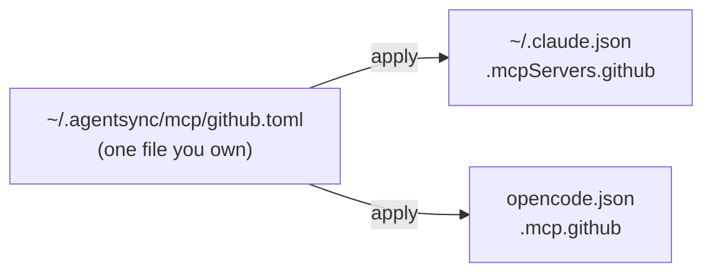

import { Steps, Aside, LinkCard, Card, CardGrid } from '@astrojs/starlight/components';

This is the greenfield path: start clean, end with an MCP server live in two
agents. About five minutes.

<Steps>

1. **Create `~/.agentsync/` and its layout.**

   ```bash
   agentsync init
   ```

2. **Register the agents you use.**

   ```bash
   agentsync agent add claude
   agentsync agent add opencode
   ```

3. **Add an MCP server once** — it will fan out to both agents.

   ```bash
   agentsync mcp add github \
     --command npx \
     --args "-y,@modelcontextprotocol/server-github"
   ```

4. **Preview before writing anything.** Always safe; never touches disk.

   ```bash
   agentsync apply --dry-run
   ```

5. **Apply for real.**

   ```bash
   agentsync apply
   ```

</Steps>

## Confirm it landed

The one server you added now lives in **both** agents' native configs, each in
its own shape:

```bash
jq '.mcpServers.github' ~/.claude.json
jq '.mcp.github'        ~/.config/opencode/opencode.json
```

<Aside type="tip" title="`apply --dry-run` is your friend">
	It prints the full [translation report](/guides/fan-out/) — what lands natively
	(✓), what's projected with loss (◐), and what's skipped (✗) — without writing a
	byte. Run it before every real apply until you trust the output.
</Aside>

## What just happened



You wrote **one** small TOML file. `apply` rendered it into each agent's native
schema — Claude's `mcpServers`, OpenCode's `mcp` (with its different transport and
`command` shape). That's the fan-out.

## Next steps

<CardGrid>
	<LinkCard
		title="The daily loop"
		description="The four commands you'll actually use day to day."
		href="/guides/daily-loop/"
	/>
	<LinkCard
		title="Add a plugin"
		description="Install once from a marketplace; every agent gets the components it understands."
		href="/guides/plugins/"
	/>
	<LinkCard
		title="Reference a secret"
		description="Stop hard-coding tokens. Pull them from an age-encrypted vault at apply time."
		href="/guides/secrets/"
	/>
	<LinkCard
		title="Already have configs?"
		description="Import an existing Claude / OpenCode setup instead of retyping it."
		href="/getting-started/existing-configs/"
	/>
</CardGrid>
