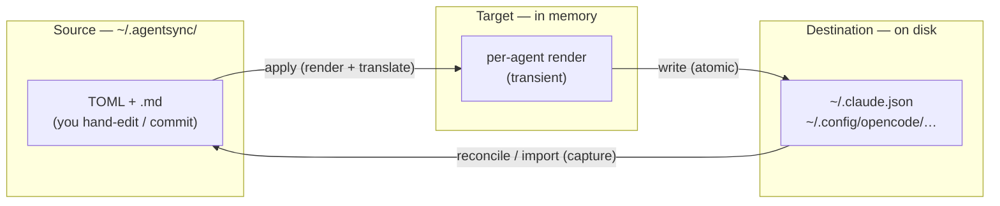

import { Aside, LinkCard } from '@astrojs/starlight/components';

agentsync borrows its model from [chezmoi](https://www.chezmoi.io/): you keep one
**canonical source** of truth, you **apply** it to produce the real files agents
read, and when something edits those files out from under you, agentsync detects
the **drift** and helps you **reconcile** it.

Read this page once and the rest of the docs — and `agentsync --help` — will click
into place.

## Three states, one comparison



- **Source** — what *you* committed in `~/.agentsync/`. The intent.
- **Target** — what the source *renders to* for a given agent, computed fresh in
  memory at apply time. It lives nowhere on disk.
- **Destination** — what's *actually on disk* in each agent's native config right
  now.

## The four verbs

| Verb | What it does |
| --- | --- |
| **`apply`** | Renders the source and writes each agent's native config. |
| **`status`** | "What's out of sync?" — a summary across all agents. |
| **`diff`** | "Show me exactly what changed." Secrets are redacted. |
| **`reconcile`** | An agent edited its config — merge that edit back, or override it. |

That's the whole tool. Everything else is detail.

<Aside type="note" title="Drift is just a hash comparison">
	agentsync records the hash of everything it writes. If a destination's hash no
	longer matches what it last wrote, the file was edited outside agentsync — that's
	**drift**. If your source's hash changed, that's a normal **pending** change. If
	both changed, it's a **conflict**, and agentsync stops to ask you.
</Aside>

## See it end to end

```bash frame="terminal"
# You edit ~/.agentsync/  →  push to agents
agentsync apply

# An agent edited its own config  →  bring the edit home
agentsync status              # spot the drift
agentsync diff claude         # inspect it (resolved secrets masked)
agentsync reconcile           # interactively resolve
```

<LinkCard
	title="Concepts & glossary"
	description="The full three-state model, the 9-case drift classifier, and every term defined."
	href="/concepts/"
/>
