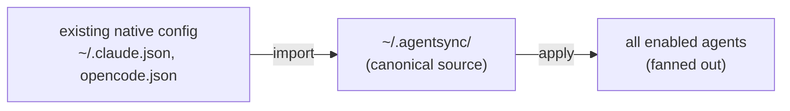

import { Steps, Aside } from '@astrojs/starlight/components';

**Goal:** you've been using Claude and OpenCode for a while, each hand-configured.
Bring it all under agentsync without retyping — and without losing anything.

<Steps>

1. **Initialize** (if you haven't) and register your agents:

   ```bash
   agentsync init
   agentsync agent add claude
   agentsync agent add opencode
   ```

2. **Survey** what's on disk versus what agentsync would write:

   ```bash
   agentsync status
   ```

3. **Import** each agent's existing config into your canonical source. Preview
   first:

   ```bash
   agentsync import claude --dry-run
   agentsync import claude
   agentsync import opencode
   ```

   Imported secrets are re-referenced to `${secret:…}` form on the way in, so
   nothing sensitive lands in your source as cleartext.

4. **Review** the imported source files in `~/.agentsync/` and tidy as needed —
   they're plain TOML and markdown.

5. **Apply.** The first apply treats any remaining pre-existing native files as a
   `foreign-collision`: it backs each up to
   `~/.agentsync/.state/backups/<timestamp>/` *before* writing.

   ```bash
   agentsync apply --dry-run    # see exactly which files get backed up
   agentsync apply
   ```

</Steps>

<Aside type="caution" title="Nothing is lost — but preview anyway">
	The first apply on a populated machine backs up everything it's about to
	overwrite. It's non-destructive. Still, run `apply --dry-run` first so there are
	no surprises, and note where the backups live: `.state/backups/<ts>/`.
</Aside>

## Import vs. apply, at a glance



**Import** pulls each agent's config *in* to one canonical source; **apply** pushes
that source back *out* to every agent — so a server you only had in Claude now
also lands in OpenCode.

<Aside type="tip" title="Owned-key hand-edits">
	If you later hand-edit a key agentsync already owns in a shared file, run
	`agentsync reconcile` **before** the next `apply` to capture the edit — apply
	overwrites owned keys without a backup. See
	[Troubleshooting](/help/troubleshooting/).
</Aside>
